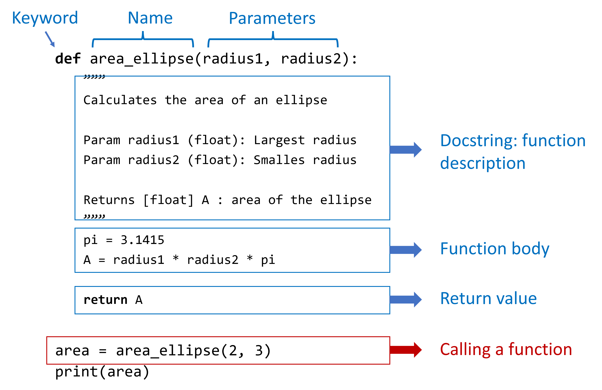
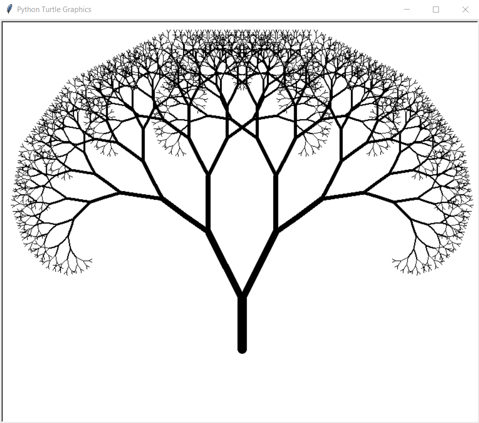

# Exercises on functions

We will exercise creating functions and use them within problems similar to the ones we encountered before during recitation. Remember the different elements of the function definition:

{width=70%}

At the beginning of the script you should first import the required libraries (numpy and matplotlib):

```{.python}
# Import numpy and matplotlib
import numpy as np
import matplotlib.pyplot as plt
```

```{python}
#| echo: false
# Import numpy and matplotlib
import numpy as np
import matplotlib.pyplot as plt
```


## Calculate the factorial of a number (Spring 2024)

Calculate the value of the factorial of a number by defining a new function: `factorial(n)`. Use the following script as basis:

```{python}
# input parameter
n = 5

# calculate the factorial
f = 1
for i in range(2, n+1):
  f = i * f

# print the factorial
print(f"The value of {n}! = {f}")
```

## Calculate the number of combinations (Spring 2024)

The number of combinations of k items out of a set of n objects is defined in statistics as
$$
\mathcal{C}_k^n = \begin{pmatrix}n\\k\end{pmatrix} = \frac{n!}{(n-k)! \, k!}
$$
where $k \leq n$.

- Use the function `factorial(n)` which you created in previous exercise 1 to calculate the number of combinations $\mathcal{C}_3^5$.
- Afterwards create a function `combinations(n, k)` to compute the combinations.

## Intersection of two lines (Spring 2024)

Find the intersection point $p = (x_p, y_p)$ between two lines with equations

$$
\left\{\begin{aligned}
y = m_1\, x + c_1\\
y = m_2\, x + c_2\\
\end{aligned}\right .
$$
To find the intersection we extract the x-value by making use of the fact that at the intersection the y-values should be equal.
$$
\begin{aligned}
m_2\, x_p + c_2 &= m_1\, x_p + c_1\\
\Rightarrow (m_2 - m_1)\, x_p &= c_1 - c_2\\
\Rightarrow x_p &= -\frac{c_2 - c_1}{m_2 - m_1}\\
\end{aligned}
$$
then we substitute the found $x_p$ coordinate into one of the equations of the system to obtain the $y_p$ coordinate:
$$
y_p = m_1\, x_p + c_1
$$
As example parameters of the lines: pick $m_1 = 1/5$ and $m_2 = 7$ as the direction coefficients, and $c_1 = 2$ and $c_2 = -3$ the off-sets at $x = 0$.

Convert the code to calculate the intersection point in following script into a function: `calc_intersection(m1, c1, m2, c2)` which returns `xp, yp`. Afterwards use your new function within this script.

```{python}
# Parameters of the lines
m1 = 0.2; c1 = 2
m2 = 7; c2 = -3

# Calculate the intersection point 
# (convert the next couple of lines into a function)
xp = -(c2 - c1) / (m2 - m1)
yp = m1 * xp + c1

# Calculate the coordinates for the lines to plot
x = np.linspace(-7, 7, 100)
y1 = m1 * x + c1
y2 = m2 * x + c2

# Plot the lines and the intersection point
fig, ax = plt.subplots()
ax.plot(x, y1)
ax.plot(x, y2)
ax.plot(xp, yp, marker="x")
ax.set_xlim([-7, 7])
ax.set_ylim([-5, 5])
ax.set_aspect("equal")
plt.show()
```

## Intersection of many lines (Spring 2024)

Use the function that you created in previous exercise to calculate the intersection of a line with a list of other lines defined by:

```{python}
# Parameters of the single line:
m1 = -0.1
c1 = 2

# Parameters of the other lines:
m_list = [-3, 2, -1.5, 3,  -1, 10]; 
c_list = [3,   1, -1,  -2, -1,   0]
```

The output plot should look as follows:

```{python}
#| echo: false
def calc_intersection(m1, c1, m2, c2):
  xp = -(c2 - c1) / (m2 - m1)
  yp = m1 * xp + c1
  return xp, yp

# Parameters of the single line:
m1 = -0.1
c1 = 2

# Parameters of the lines:
m_list = [-3, 2, -1.5, 3,  -1, 10]; 
c_list = [3,   1, -1,  -2, -1,   0]

# Calculate the coordinates for the first line
x = np.linspace(-7, 7, 100)
y1 = m1 * x + c1

# Initialize the plot
fig, ax = plt.subplots()
ax.plot(x, y1, linewidth=3)

# Loop over all the other lines
for i in range(len(m_list)):
  m2 = m_list[i]
  c2 = c_list[i]
  # Calculate the second line
  y2 = m2 * x + c2
  # Calculate the intersection point
  xp, yp = calc_intersection(m1, c1, m2, c2)
  # Plot the lines and the intersection point
  ax.plot(x, y2, color="gray")
  ax.plot(xp, yp, marker="x")

ax.set_xlim([-7, 7])
ax.set_ylim([-5, 5])
ax.set_aspect("equal")
plt.show()
```

## Drawing the Koch curve (Spring 2025)

Fractals are easiest defined by recursive algorithms. Look at the following code which draws (one side of) the Koch curve. 

- Afterwards try to adapt the code to plot the whole Koch curve (the three sides of the snowflake)

``` {.python}
import turtle

def koch(a, order):
    if order > 0:
        for t in [60, -120, 60, 0]:
            koch(a/3, order-1)
            turtle.left(t)
    else:
        turtle.forward(a)

# Draw the Koch curve using Turtle
turtle.setworldcoordinates(-10, -10, 100, 100)
turtle.pensize(3)
turtle.pencolor("blue")
turtle.speed(10) # possible issue
koch(100, 4)
```

## Intersections of two low-degree polynomials (Spring 2026)

Find and plot the intersections of two given quadratic polynomials. Use a function to get the roots of a quadratic equation, and another function which uses the first function to get the coordinates of the intersection point(s). The plot the curves of two example polynomials and the intersections, see the output below.

```{python}
#| echo: false
# Practical 6: Exercise 1
from math import sqrt
import matplotlib.pyplot as plt
import numpy as np


def get_roots(a=0, b=0, c=0):
    """Calculate real-valued roots of the quadratic equation:
        a*x^2 + b*x + c = 0

    :param a: coefficient second order term, defaults to 0
    :param b: coefficient first order term, defaults to 0
    :param c: coefficient constant term, defaults to 0
    :return: number of roots, list of roots 
    :rtype: int, [int]
    """
    D = b ** 2 - 4 * a * c
    if D < 0:
        return 0, []
    elif D == 0:
        return 1, [-b / (2.0 * a)]
    elif D > 0:
        x1 = (-b - sqrt(D)) / (2.0 * a)
        x2 = (-b + sqrt(D)) / (2.0 * a)
        return 2, [x1, x2]


def polynomial_intersection(a1=0, b1=0, c1=0, a2=0, b2=0, c2=0):
    """Find the intersecting (x, y)-coordinates of two polynomials

    :param a1: Polynomial 1, coefficient second order term, defaults to 0
    :param b1: Polynomial 1, coefficient first order term, defaults to 0
    :param c1: Polynomial 1, coefficient constant term, defaults to 0
    :param a2: Polynomial 1, coefficient second order term, defaults to 0
    :param b2: Polynomial 1, coefficient first order term, defaults to 0
    :param c2: Polynomial 1, coefficient constant term, defaults to 0
    :return: number of roots, list of x-coordinates, list of y-coordinates 
    :rtype: int, [int], [int]
    """
    n_roots, xs = get_roots(a1-a2, b1-b2, c1-c2)
    ys = [a1 * x ** 2 + b1 * x + c1 for x in xs]
    
    return n_roots, xs, ys


# Script
# Parameters of two polynomials
a1 = 2; b1 = 1; c1 = -4
a2 = 0; b2 = -3; c2 = 5

# Extract the intersecting points
n_roots, xs, ys = polynomial_intersection(a1=a1, b1=b1, c1=c1, a2=a2, b2=b2, c2=c2)

# Plot the curves and annotate the intersection points
if n_roots > 0:
    xx = np.linspace(xs[0]-1, xs[-1] + 1, 100)
else:
    xx = np.linspace(-2, 2, 100)

yy1 = a1 * xx ** 2 + b1 * xx + c1
yy2 = a2 * xx ** 2 + b2 * xx + c2
plt.plot(xx, yy1)
plt.plot(xx, yy2)
plt.scatter(xs, ys, color="green")
plt.show()
```

## Recursive function for the factorial of a number (Spring 2026)

Calculate the value of the factorial of a number: $N! = N\cdot(N-1)\cdot\dots\cdot 2 \cdot 1$ in two different ways: 

- defining a function: `standard_factorial(n)` where you use a for loop as in a previous exercise.
- defining a recursive function: `recursive_factorial(n)` where you define the factorial by recursively letting the function call itself.


```{python}
#| echo: false
def standard_factorial(N):
    """Calculates the factorial of N:   N! = N(N-1)(N-2) ... 2 1

    :param N: integer
    """
    f = 1
    for i in range(2, N+1):
        f = f * i
    
    return f


def recursive_factorial(N):
    """Calculates the factorial of N:   N! = N(N-1)(N-2) ... 2 1
    This is a recursive function.
    
    :param N: integer
    """
    if N > 1:
        return N * recursive_factorial(N-1)
    else:
        return 1
    

# Print example output for N = 5
N = 5
print(f"standard_factorial({N}) = {standard_factorial(N)}")
print(f"recursive_factorial({N}) = {recursive_factorial(N)}")
```

## Recursive Laplace's determinant expansion

The determinant of a matrix can be calculated via Laplace's expansion. For an example $3\times 3$ matrix and expansion along the first row we have:

$$
\begin{aligned}
\det(M) &= \begin{vmatrix} 
1 & -3 & -1 \\ 1 & 2 & -1 \\ 0 & 4 & 9 
\end{vmatrix}\\
&\\
&= (-1)^{0} \cdot 1 \cdot \begin{vmatrix} 
2 & -1 \\ 4 & 9 
\end{vmatrix} 
+ (-1)^{1} \cdot (-3) \cdot \begin{vmatrix} 
1 & -1 \\ 0 & 9 
\end{vmatrix}
+ (-1)^{2} \cdot (-1) \cdot \begin{vmatrix} 
1 & 2 \\ 0 & 4 
\end{vmatrix}\\
&\\
&= 1 \cdot ( 2 \cdot 9 - (-1) \cdot 4) +3 \cdot ( 1 \cdot 9 - (-1) \cdot 0) - 
1 \cdot ( 1 \cdot 4 - 2 \cdot 0)\\ 
&\\
&= 22 + 27 - 4 = 45
\end{aligned}
$$

Implement Laplace's expansion on this example matrix by defining the recursive function `laplace(mat)` where `mat` is the matrix and call the function with the initial matrix defined as: 
`mat = np.array([[1, -3, -1], [1, 2, -1], [0, 4, 9]])`. Then compare your function to the one of `np.linalg.det()`. The output of the script for this matrix should be:

```{python}
import numpy as np


def laplace(mat):
    n = mat.shape[0]
    det = 0
    if n > 1:
        for j in range(n):
            minor = np.delete(mat[1:, :], j, axis=1)
            # print(minor)
            det = det + (-1) ** j * mat[0, j] * laplace(minor)
    else:
        det = mat[0, 0]

    return det


# Define a matrix
mat = np.array([[1, -3, -1], [1, 2, -1], [0, 4, 9]])

# Calculate the determinant using our recursive function
det = laplace(mat)
print(f"Determinant calculated by our function: {det}")

# Compare with Numpy's linalg.det() function
det_numpy = np.linalg.det(mat)
print(f"Determinant calculated by numpy: {det_numpy}")
```

## Fractal tree with turtle

Tree structures have natural fractal structures, where branch thickness and length decreases. The younger ("deeper" in recursion) branches are thinner and shorter since they had less time to grow. Implement the tree structure shown below using the Python built-in Turtle package. There are various implementations possible: try to use 

- a recursive function `tree(my_turtle, n, length, thickness)` where you keep track of the depth $n$, the length of the branch, and the thickness of the branch.
- Create two branches (left and right) at a fixed angle. Use methods such as `my_turtle.goto(pos)`, `my_turtle.seth(angle)`, `pos = my_turtle.pos()`, `angle = my_turtle.heading()`, etc. to set and get position and orientation of the "turtle".

{width=70%}

