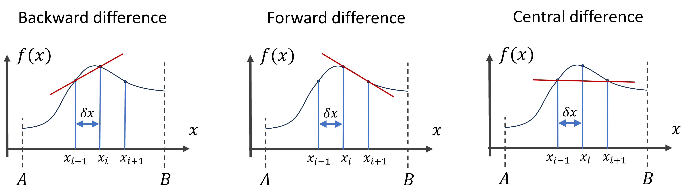

# Numerical algorithms

## Compute an integral numerically (Spring 2024)

Numerically integrate the following integral 

$$ 
\int_0^2 \text{dx}\, (x^3 - x/3) 
$$

(1) As a first approximation try to use the rectangular approximation (Riemann sum).
Therefore, divide the interval $[0, 2]$ in $N$ parts and approximate the area surrounding 
each point by a thin rectangle. The sum of all rectangle areas then approximates the 
total area under the curve (see the figure below), i.e. the integral. For a general interval $[A, B]$ and
function $y = f(x)$ we can numerically calculate the integral using:
$$ 
\int_A^B \text{dx}\, f(x) \approx \sum_{i = 1}^N f(x_i) \delta x
$$
With $x_i = A + (i - 1/2)\times \delta x$, and $\delta x = (B - A) / N$. This sum
is also called **Riemann sum**. In principle, we should take the limit $N\rightarrow \infty$ to obtain the analytic result or actual Riemann integral, but as an approximation we take $N$ a finite (large number).

![Numerical integration of a definite integral over interval $[A, B]$ interval. The **left** panel illustrates the Riemann sum, where the area under the curve is approximated by rectangles. On the **right** the Trapezium rule is illustrated where the area is approximated by trapeziums instead of rectangles, increasing the accuracy.](./figures/fig_integration.png){width=70%}

(2) Compare the result with the analytic result: 
$$
[x^4/4 - x^2/6 \, ]_0^2 = 10/3
$$
(3) Then use the **trapezium rule**, see the figure above, in which instead of rectangles we use trapeziums, 
following the curve more accurately. The area of a trapezium with two vertical sides and one horizontal bottom side is given the width times the average length of the vertical sides. 

$$ 
\int_A^B \text{d}x\, f(x) \approx \sum_{i = 1}^N \frac{f(x_i) + f(x_{i-1})}{2} \delta x
$$
With $x_i = A + i\times \delta x$, and $\delta x = (B - A) / N$. This sum should more accurately reflect the area under the curve (the integral) than the Riemann sum. 

(4) This formula is used so often that Numpy has a function for it: `np.trapz(y, x)`. Compare your result with the result of this function.

## Compute derivatives numerically (Spring 2024)

The derivative of a function in a point can be numerically approximated by finite difference methods. The following formula gives us the **forward finite difference**:
$$
\frac{\text{d} f(x)}{\text{d} x} \approx \frac{f(x_{i+1}) - f(x_{i})}{\delta x}
$$
If we would take the limit of $\delta x \rightarrow 0$ then we would obtain the actual derivative. Here however we will approximate the derivative with a finite-sized $\delta x$. We we want to calculate the derivative over an interval we will as we did for the integral divide the interval in $N$ pieces and set $\delta x = (B-A)/N$. Thereby we can plot the derivative over the whole interval $[A, B]$ (except of the last point at B, for which we can't compute the forward derivative).
Similarly, the **backward finite difference** is defined as:
$$
\frac{\text{d} f(x)}{\text{d} x} \approx \frac{f(x_{i}) - f(x_{i-1})}{\delta x}
$$
And the mean of the two becomes the **central difference**:
$$
\frac{\text{d} f(x)}{\text{d} x} \approx \frac{1}{2}\left( \frac{f(x_{i+1}) - f(x_{i})}{\delta x} + \frac{f(x_{i}) - f(x_{i-1})}{\delta x} \right) = \frac{f(x_{i+1}) - f(x_{i-1})}{2\delta x}
$$



(1) Numerically compute and plot the forward derivative of $f(x) = \sin(5 \pi x)/ (1 + x^2)$ within interval $[-3, 3]$. Ignore the issue at the last point.
(2) Do the same for the central difference, do you find any difference for small values of $N$? 

## Solve a system of equations

Solve the following system of equations in $x$, $y$, and $z$:

$$
\left\{
\begin{aligned}
x + y & = 0 \\
x + y + z & = 5 \\
2x - z  & = -2 \\
\end{aligned}
\right.
$$

by converting it to a matrix equation:

$$
\begin{pmatrix}
1 & 1 & 0\\
1 & 1 & 1\\
2 & 0 & -1\\
\end{pmatrix}
\begin{pmatrix}
x\\
y\\
z
\end{pmatrix}
=
\begin{pmatrix}
0\\
5\\
-2
\end{pmatrix}
$$
And then multiplying both sides of the equation by the inverse matrix from the left.

$$
\begin{pmatrix}
1 & 1 & 0\\
1 & 1 & 1\\
2 & 0 & -1\\
\end{pmatrix}^{-1}
\begin{pmatrix}
1 & 1 & 0\\
1 & 1 & 1\\
2 & 0 & -1\\
\end{pmatrix}
\begin{pmatrix}
x\\
y\\
z
\end{pmatrix}
=
\begin{pmatrix}
1 & 1 & 0\\
1 & 1 & 1\\
2 & 0 & -1\\
\end{pmatrix}^{-1}
\begin{pmatrix}
0\\
5\\
-2
\end{pmatrix}
$$
$$
\Rightarrow 
\begin{pmatrix}
x\\
y\\
z
\end{pmatrix}
=
\begin{pmatrix}
1 & 1 & 0\\
1 & 1 & 1\\
2 & 0 & -1\\
\end{pmatrix}^{-1}
\begin{pmatrix}
0\\
5\\
-2
\end{pmatrix}
$$
Thereby calculate and print the values for $x$, $y$, and $z$. Verify by hand whether this is indeed a solution.


```{python}
#| echo: false
#| output: false
import numpy as np

a = np.array([[1,1,0],[1,1,1],[2,0,-1]])
a_inv = np.linalg.inv(a)
print(a_inv)
v = np.dot(a_inv, np.array([[0],[5],[-2]]))
print(v)

```

