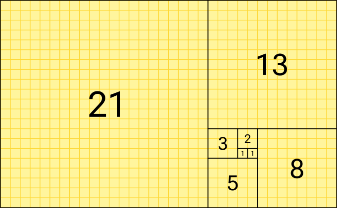
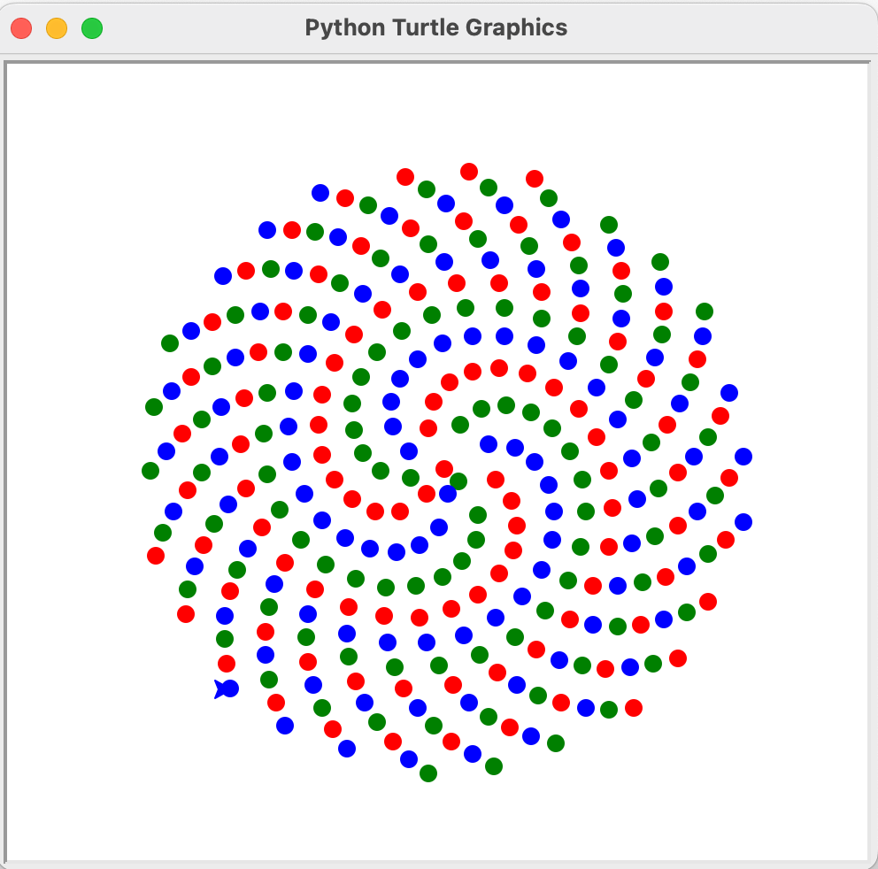
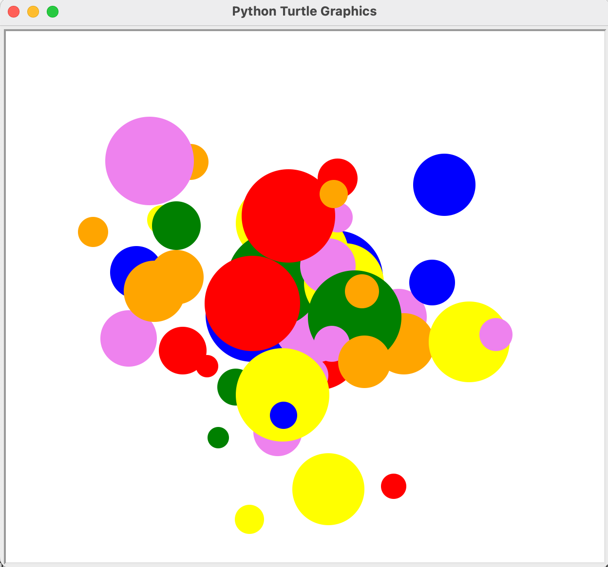

# Turtle graphics

## Fibonacci square tiling with turtle

Turtle in a educational drawing tool built into Python. For more information about the turtle module, see [the turtle documentation](https://docs.python.org/3/library/turtle.html).

Generate Fibonacci numbers, see the problem of previous section, and use the turtle module to draw a Fibonacci tiling, see below image. To do this, you can use the Fibonacci numbers calculated in the previous task as the side lengths of the squares. Start with a square of side length 1, then draw a square of side length 1 next to it, then a square of side length 2 next to those two, and so on. Use the `forward()` and `right()` methods of the turtle to move it around and draw the squares. To draw a square of side length `side_length`, repeat the following steps four times:
```{.python}
  my_turtle.forward(side_length)
  my_turtle.left(90)
```
Hint: For drawing the next square, you want to go to the opposite corner and turn. Test out a couple of options till you get the correct pattern.

{width=50%}

After you have made this pattern, try to use AI-assisted code generation to do the same exercise and compare your manually written code with the AI-generated code.

## Fibonacci sunflower pattern with turtle 

Make the turtle draw a sunflower pattern related to the Fibonacci sequence. The pattern is created by placing points at angles that are multiples of the golden angle $\phi = 180 (3 - \sqrt{5}) \approx 137.5^\circ$ and at an increasing radius:
$$
r = c \sqrt{n},\qquad \theta = \phi n
$$
To plot the points, first use `penup()` so you don't draw lines between the points, then use the `goto(x, y)` method of the turtle, where `x` and `y` are the Cartesian coordinates of the point. To plot the points use `dot(10)` where 10 is the size of the dot. Change the color by e.g. `color("red")`. You can convert from polar coordinates to Cartesian coordinates using the following formulas:
$$
x = r \cos(\theta),\qquad y = r \sin(\theta)
$$
See the below image for example output. Try to add more colors to the list of colors to change the appearance of the pattern.

{width=50%}

## Draw random dots with turtle

Plot N random dots on the screen using the turtle module. The position the dots should be randomly generated (Gaussian distribution), and the color and size of each dot should also be randomly generated. You can use the `random` module to generate random numbers for the position, color, and size of the dots. For example, you can use `random.gauss(mu, sigma)` for a Gaussian distribution with mean `mu` and standard deviation `sigma`, `random.uniform(a, b)` to generate a random float between `a` and `b`, and `random.choice(list)` to randomly select an element from a list. Output could look something like the below image.

{width=50%}
