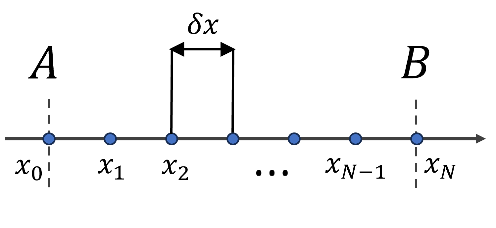
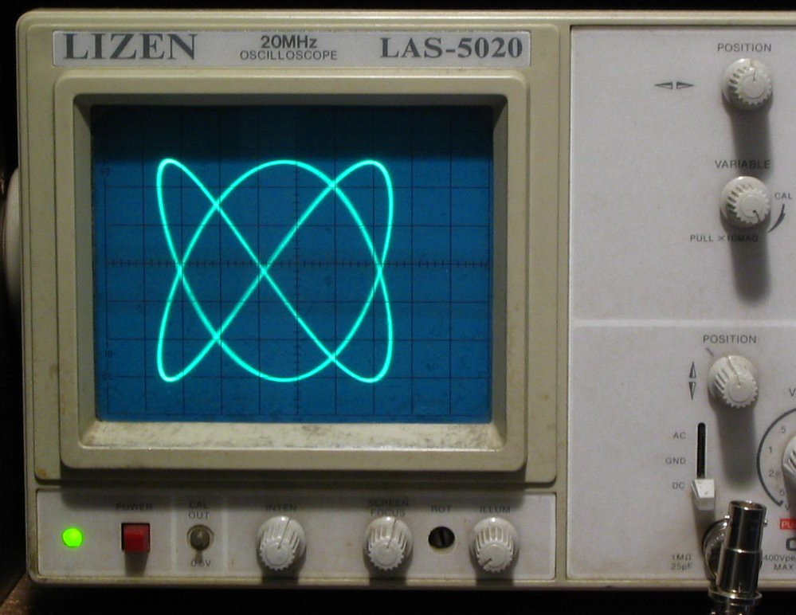
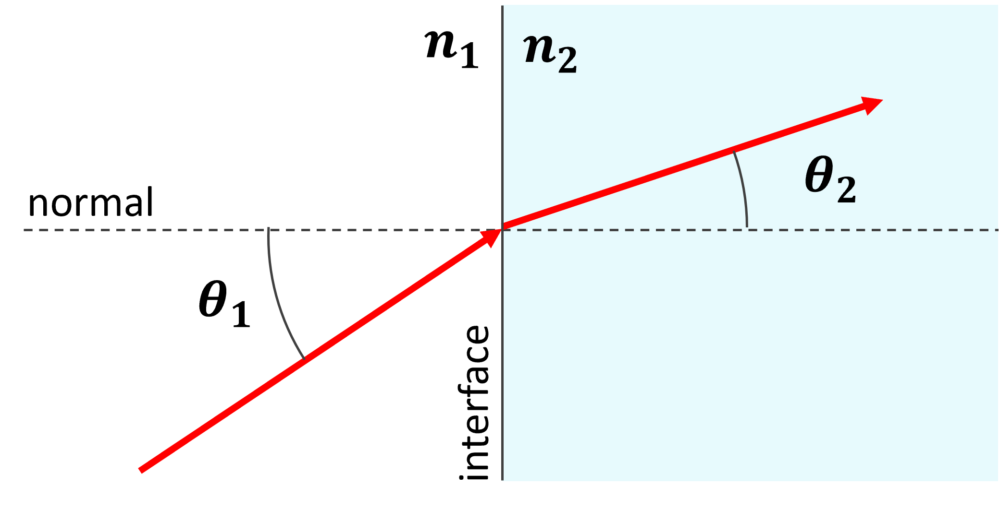

# Introduction

This document contains the exercises performed in practical sessions during passed years. The solutions for the problems can be found in another document.

# Expressions in the Python console

Calculate the values $y$ of following expressions, where $a = 3$, $b = 3/7$, $c = 3.00 \times 10^8$. First assign the parameters a, b, c, and import the functions you need from the `math` package. For the complex exponential function import `exp` from `cmath` instead of `math`. To use the imaginary unit $i$ type `1j`. The results are given in blue so you can compare:

$$
\begin{aligned}
&y = 3 a^5 - b^2 {\quad\color{Blue}\approx 728.8} \qquad\qquad &y = \frac{i a b}{a-b} {\quad\color{Blue} = 0.5 i} \qquad\qquad &y = (40 / c)^4 {\quad\color{Blue}\approx 3.16\times 10^{-28}}\\
&y = \sqrt{5} / b^2 {\quad\color{Blue}\approx 12.2} \qquad\qquad &y = \sin(b \pi) \times \frac{1 + b^2}{a^2} {\quad\color{Blue}\approx 0.13} \qquad\qquad &y = \arctan(a) {\quad\color{Blue}\approx  1.25}\\
&y = \frac{\sinh(1)}{2} {\quad\color{Blue}\approx  0.59} \qquad\qquad &y = \frac{e^{i\pi/4}}{\sqrt{2}} {\quad\color{Blue} = \frac{1+i}{2}} \qquad\qquad &y = \frac{6!}{10!} {\quad\color{Blue}\approx 1.98\times 10^{-4}}\\
\end{aligned}
$$

## Commando-style calculations (Spring 2024)

$$
\begin{aligned}
x & = 4               \qquad\qquad & x & = 20         \qquad\qquad & x & = -5 \\
y & = x^2             \qquad\qquad & y & = x / 4      \qquad\qquad & y & = x^(x+3)  \\
y & = 5 \times y      \qquad\qquad & y & = y + 2      \qquad\qquad & y & = \frac{y}{5 - y} \\
y & = y - 23          \qquad\qquad & y & = 3/2 y      \qquad\qquad & y & = 4.5 \. y  \\
y & = \frac{y}{2}     \qquad\qquad & y & = \sqrt{y}   \qquad\qquad & y & = \frac{1}{y} \\
y & = \,\, ?          \qquad\qquad & y & =  \,\, ?    \qquad\qquad & y & = \,\, ? \\
\end{aligned}
$$

## Expressions with the math library (Spring 2024)

Import the math library or/and functions thereof to calculate the below expressions.
Put $x = 4$, $a = 2$, $b = 10$ and calculate the following expressions:

$$
\begin{aligned}
y & = 4 \, \frac{a \, x}{1 + \sin(x)}            \qquad\qquad & y & = \sinh(a \, x) \\
y & = \tan(x^2)                                 \qquad\qquad & y & = x / \textrm{erf}(x/b) \\
y & = 5 \times \exp(\sin(b \, x)/x^a)              \qquad\qquad & y & = x + 2\, \sqrt{a - x/b}  \\
y & = \sqrt{i x + a}                     \qquad\qquad & y & = \cos(2 \pi \, a\, x) \\
y & = \frac{x^{i a + 1}}{b}     \qquad\qquad & y & = \cos(x) \times \sqrt{\sin(x)} \\
\end{aligned}
$$


# Input, formatting output, and expressions in Python scripts

## Body Mass Index calculator

Prompt a user for his/her height and length, then calculate his/her body mass index and print it to the screen. The body mass index is a rather inaccurate measure for body fat and is given by the formula: $\textrm{BMI} = \textrm{weight}/\textrm{height}^2 \textrm{kg}/\textrm{m}^2$ where the weight is in kilograms and height in meters.

```{python}
#| echo: false
print("height in centimeters: ")
s = "Apples are sometimes green"
print(f"(a) Uppercase sentence: {s.upper()}")
print(f"(b) With quotes: {'"' + s + '"'}")
n = 4
print(f"(c) Repeated {n} times: {n * (s + "? ")}")
print(f"(d) On separate lines:\n{s.replace(" ", "\n")}")
```


## Text transformations

Prompt the user for a sentence. The perform the following tasks:

a) Make all characters in the sentence upper case.
a) Surround the sentence by double quotes. 
a) Append a question mark "? " to the sentence and print it $n$ times on the same line (where $n$ is a parameter).
a) Print the words of the sentence on separate lines by replacing spaces by `\n` as a line separator (`\n` is the escape code to start a new line)

```{python}
#| echo: false
print("Please provide a sentence: Apples are sometimes green")
s = "Apples are sometimes green"
print(f"(a) Uppercase sentence: {s.upper()}")
print(f"(b) With quotes: {'"' + s + '"'}")
n = 4
print(f"(c) Repeated {n} times: {n * (s + "? ")}")
print(f"(d) On separate lines:\n{s.replace(" ", "\n")}")
```

## Tsiolkovsky rocket equation

To launch a satelite into a Lower Earth Orbit (LEO) a space rocket needs to reach an orbit velocity $\Delta v$ of approximately $\Delta v \approx 7.8$ km/s or $28,080$ km/h. The amount of fuel required depends on the mass of the empty rocket plus satelite and fuel via the Tsiolkovsky rocket equation:

$$
\Delta v = v_e \ln \frac{m_0}{m_f} \qquad\Rightarrow\qquad \frac{m_0}{m_f} = \frac{m_\textrm{rocket} + m_\textrm{satelite} + m_\textrm{fuel}}{m_\textrm{rocket} + m_\textrm{satelite}} = e^{\Delta v/v_e}
$$

Where $m_0$ is the initial mass of the rocket (and satelite) including propellant (fuel), $m_f$ is the final mass of the empty rocket (with satelite), and $v_e = 2.5$ km/s the effective exhaust velocity for this specific rocket.

Prompt the user to give a masses of the satelite and the empty rocket to be launched ($m_f$) and respond with the required fuel to reach the required $\Delta v = 7.8$ km/s.

## Formatted table: unit conversion

Prompt the user for a distance in meters. Then print a table with the distance in units of inches, feet, yard, and mile on the different rows. The units can be converted to metric units by: 1 inch = 2.54 cm, 1 foot = 12 inches, 1 yard = 3 feet, and 1 mile = 1,760 yards. Column 1 should represent the distance with two digits after the decimal point, in column 2 with scientific notation with 2 significant figures, and the last column the units. Use formatted strings to make sure the columns are equally wide.

## Glorifier (Spring 2025)

Prompt a user for his/her name. Print the sentence: "All hail [name of the user]" as a response.

## Repeat words (Spring 2025)

Prompt the user for a word. Print the word 8 times on one line with spaces in between and put an exclamation mark at the end.

## Braking distance (Spring 2025)

Prompt a user for the speed of a car. Calculate the braking distance on asfalt and concrete roads and print them. The (kinetic) friction constants for concrete and asphalt are given in following table:

| Material |	Kinetic |	Static
| ---- | ---- | ---- |
| Rubber on concrete (dry) | 0.68 |	0.90 |
| Rubber on concrete (wet) |	0.58 |	-.-- |
| Rubber on asphalt (dry) |	0.72 |	0.68 |
| Rubber on asphalt (wet) |	0.53 |	-.-- |
| Rubber on ice |	0.15 |	0.15 |

The braking distance $D$ for a car driving at a speed $v$ is determined by the perception-reaction time $t_r \approx 1$ of the driver and the friction coefficient of the road $\mu$ according to the following formula ($g = 9.81\,m/s^2$):

$$
D = v t_r + \frac{v^{2}}{2 \mu g}
$$

## Velocity measurement by radar gun (Spring 2025)

Traffic police officers can use a radar gun to measure the speed of a car. The difference in frequency $f_t$ send out by the radar gun and the received echo $f_e$ gives the Doppler frequency $f_d = f_t - f_e$. This frequency is related to the velocity of the car by: 

$$
f_{d} \approx 2 v \frac{f_t}{c'}
$$

where $c' = c / 1.0003$. Suppose the radar device is operated in the K-band: $f_t = 24$ GHz. Calculate the Doppler beating frequency $f_{d}$ measured by the officer if you pass him with a speed $v = 200$ km/h.

## Chevaux-Vapeur car tax calculator (Spring 2025)

Automatically calculate the tax on cars in France (before 1957). For this, ask a user following properties of his/her car:

  - Cylinder capacity of his/her car $C$ (e.g. 1.3 liters)
  - Maximum revolutions/minute $\omega$

Then print the amount that the user should pay for his/her car. To calculate the tax use the following formula:

$$
  CV =  C K (60 \omega)
$$

where $K$ is for a four-cylinder engine: $1.5 \times 10^{-4}$.

## Formatted table of numbers (Spring 2025)

Prompt the user for two floating point numbers and print a table with on the rows the numbers the number itself, the square, and the square root of the number and as columns the two resulting numbers and their sum.
Use formatted strings to set the number of digits after the decimal point.

# Conditional Statements

## Check login

Prompt the user to give his/her username and password. Verify whether the username is `amapirate` and his/her password is `greenbeans`. If correct, tell the user that he the login was successful. Example output:

`Please provide your login credentials:`\
`username: Micky`\
`password: redbeans`\
`Sorry, your username or password is incorrect.`

## Roots of a quadratic equation

The roots of a quadratic equation: $a x^2 + bx + c = 0$ are given by: 
$$
x_\pm = \frac{-b \pm \sqrt{D}}{2a} = \frac{-b \pm \sqrt{b^2 - 4ac}}{2a}, \qquad \textrm{with discriminant }D = b^2 - 4ac
$$ 

The number of roots is determined by the value of the discriminant $D$:

- $D > 0$: two roots, $x_-$ and $x_+$,
- $D = 0$: one root, $x = x_- = x_+$,
- $D < 0$: no real roots, $x_-$ and $x_+$ become complex.

Prompt the user for parameters a, b, and c of the quadratic equation, then calculate the number of roots by calculating first the discriminant $D = b^2 - 4ac$. Afterwards print the (real-valued) roots. Example output:

``` {python}
from math import sqrt

print(f"--- Roots of the equation ax^2 + bx + c = 0 ---")
a = 2
b = 3
c = -5
print(f"Parameter a: {a}")
print(f"Parameter b: {b}")
print(f"Parameter c: {c}")
D = b**2 - 4 * a * c
if D > 0:
    xm = (-b - sqrt(D)) / (2 * a)
    xp = (-b + sqrt(D)) / (2 * a)
    print(f"The discriminant D = {D} > 0, two roots x = {xm}, {xp}")
elif D == 0:
    x = -b / (2 * a)
    print(f"The discriminant D = {D} = 0, one root x = {x}")
else:
    print(f"The discriminant D = {D} < 0, no real roots!")
```

# For and While loops

## Number series

Print the values of $1/n$ for $n \in [5, 10]$, each on a separate line. Use first a while loop, then try to use a for loop (which one is easier?). The output should look as follows: 

``` {python}
N = 10
for i in range(5, N + 1):
  print(f"1/{i} = {1/i:.3}") 
```

## Power series

Consider the approximation of Eulers constant $e = \sum_{n=0}^\infty \frac{1}{n!}$. Print the consecutive approximations where you only take the first $1, 2, 3, 4, ...$ terms into account and print each of them on a separate line to the console. Stop when the approximation only differs by $0.001$ or less from the real value of $e = 2.7183$ (make use of `math.e`, `math.factorial()`, and `math.fabs()`). The output should look as follows:

``` {python}
import math
dmin = 0.001
e = 0
i = 0
while math.e - e > dmin:
  e = e + 1 / math.factorial(i)
  print(f"Euler's e = {math.e:5.5} approximated to {i+1} terms = {e:5.5}") 
  i = i + 1
```

## Printing numbers (Spring 2025)

- Use a while loop to print the numbers from 1 to 10 to the screen. 
- Then use a for loop for the same task. Make use of the `range()` function for this.
- Finally, use a `for` loop to print the odd numbers from 1 to 10 to the screen.

``` {python}
#| echo: false
#| output: false
print("Print 1-10 using a while loop")
i = 0
while i < 11:
  i += 1
  print(i)

print("Print 1-10 using a for loop")
for i in range(1,11):
  print(i)

print("Print odd numbers 1-10 using a for loop")
for i in range(1,11,2):
  print(i)

```

As an example, the output of the last part should give:

``` {python}
#| echo: false
print("Print odd numbers 1-10 using a for loop")
for i in range(1,11,2):
  print(i)
```

## Decreasing series (Spring 2025)

- Use a `while` loop to print the terms of series $\sum_{n=1}^{\infty}\frac{1}{n^4}$ for which $\frac{1}{n^4} \geq 0.0001$.
- Repeat the same task but using a `for` loop (combine with a conditional statement). Remark that here the lazy evaluation of the `range()` function is also a benefit.

Output of either script should have following output:

``` {python}
#| echo: false
n = 1
t = 1 / n**4
while t > 0.0001:
  n += 1
  print(t)
  t = 1 / n**4
```

# Combining loops and conditional branching

## Prime numbers 

Prompt the user for a positive integer number $n$. Verify whether this number is prime (does not have any integer divisors except 1 and $n$). For this you can loop over all numbers $m \leq \sqrt{n}$ and check whether $n/m$ is a natural number. Use `math.sqrt()` for the square root and the modulo operator `%` which gives the rest after division (e.g. `13 % 5 = 3`) to verify whether $n$ can be divided by $m = 2, 3, 4, ...$. The output should look as follows:

``` {python}
from math import sqrt, floor

print("Give a positive integer n: 169")
N = 169
n_max = sqrt(N)
is_prime = True
for n in range(2, floor(n_max) + 1):
    if N % n == 0:
        print(f"The number {N} can be divided by {n}")
        is_prime = False

if is_prime:
    print(f"The number {N} is prime")
else:
    print(f"The number {N} is not prime")
```

## Play rock-paper-scissors

Prompt the player repetitively to choose from: [1] Rock , [2] Paper, [3] Scissors, or [4] Stop the game. Award points for winning (+1), losing (-1), or a draw (0). Use the function `randint(1, 3)` from package `random` to obtain random integers from the set $\{1, 2, 3\}$. Stop the script when the choice was 4. Example output:

`--- Let's play Rock-Paper-Scissors ---`\
`  [1] Rock , [2] Paper, [3] Scissors, or [4] Stop the game`\
`Choose 1-4: 3`\
`I had the same, score: 0`

`  [1] Rock , [2] Paper, [3] Scissors, or [4] Stop the game`\
`Choose 1-4: 2`\
`You lose, I had Scissors, score: -1`

`  [1] Rock , [2] Paper, [3] Scissors, or [4] Stop the game`\
`Choose 1-4: 1`\
`You win, I had Scissors, score: 0`

`  [1] Rock , [2] Paper, [3] Scissors, or [4] Stop the game`\
`Choose 1-4: 4`\

`Stopping game!`

## Game of higher-lower (Spring 2025)

Create a simple version of the higher-lower game where a person thinks of a number and the other has to guess it. 
Generate a random number using following code:

``` {.python}
import random
n = random.randint(0, 100)
```

Afterwards, prompt the user repetitively to make a guess, 
and tell each time whether the number is higher or lower than the guess. 
If the user guesses the actual number, stop the game. See following example output of a correct working script:

```
Guess the number [0, 100]: game started!
What is the number? 45
The number is lower, try again.
What is the number? 10
The number is lower, try again.
What is the number? 4
The number is higher, try again.
What is the number? 7
Yes, that is the number! Congratulations, you guessed it in 4 guesses.
```

# Lists

## Fibonacci sequence

Calculate the first 10 numbers of the Fibonacci sequence, put them in a list and print the list to the screen. The Fibonacci sequence is defined as follows: $F_0 = 0$, $F_1 = 1$, and $F_n = F_{n-1} + F_{n-2}$ for $n \geq 2$. More information about the Fibonacci sequence can be found [on Wikipedia](https://en.wikipedia.org/wiki/Fibonacci_number).

```{python}
fs = [0, 1]
for i in range(8):
    fs.append(fs[-1] + fs[-2])

print(fs)
```

## Printing elements of a list (Spring 2025)

Create the following list:

["yellow", "green", "blue", "red", "white", "orange", "black"]

a. Print the last element to the screen
a. Print the sublist containing the colors of the Turkish flag
a. Print the sublist with the colors of the rainbow (ignore black and white) 
and order them according to increasing wavelengths
a. Print all the elements one by one to the screen using a loop.
a. Prompt the user to tell his favorite color which is not in the list. 
If not in the list, append it to the list. Otherwise reply that it is already in the list.

Example output for tasks (a) and (b):

``` {python}
#| echo: false
l = ["yellow", "green", "blue", "red", "white", "orange", "black"]
print("Last color in the list:")
print(l[-1])
print("List of colors of the Turkish flag:")
print(l[3:5])
```

## List of soccer players (Spring 2025)

Define a list containing the names of some of the soccer players from the Kazakhstan national football team (men):

["Maksim", "Abat", "Oralkhan", "Ramazan", "Vyacheslav"]

Then perform the following tasks:

- Print the names of the list to the screen line-by-line by using a for loop.
- Print the names in reversed order to the screen. Hint: You can use `len()` and `range()` functions.
- Append the name "Dastan" to the list. Print the list, did it change? 
- Select the second player from the list and print: "[players_name] is the best player!" to the screen.
- Remove player "Abat" from the list.

Example output for the second subtask:

``` {python}
#| echo: false
players = ["Maksim", "Abat", "Oralkhan", "Ramazan", "Vyacheslav"]
print("Players in reverse order:")
players.reverse()
for player in players:
  print(player)
```

## Selling fruit (Spring 2025)

A salesperson sells fruit on the market. Create a list with the following pieces of fruit that he has initially:

["banana", "apple", "kiwi", "banana", "banana", "orange", "apple", "kiwi", "strawberry", "peach"]

Create an empty list/basket for a customer.
Repeatedly prompt the user/customer what he likes to buy. If still available, remove once from the list and add to the basket of the customer. If not in the list (or not an existing word) print that you don't have that. Stop when the user says: "That's all", and print the basket-list of the customer.

Possible output of a working script:

```
What do you like to buy: cherry
Sorry, today I don't have any cherry.
What do you like to buy: banana
Here you go.
What do you like to buy: apple
Here you go.
What do you like to buy: That's all
You bought following fruit: 
["banana", "apple"]
```

# Turtle graphics

## Fibonacci square tiling with turtle

Turtle in a educational drawing tool built into Python. For more information about the turtle module, see [the turtle documentation](https://docs.python.org/3/library/turtle.html).

Generate Fibonacci numbers, see the problem of previous section, and use the turtle module to draw a Fibonacci tiling, see below image. To do this, you can use the Fibonacci numbers calculated in the previous task as the side lengths of the squares. Start with a square of side length 1, then draw a square of side length 1 next to it, then a square of side length 2 next to those two, and so on. Use the `forward()` and `right()` methods of the turtle to move it around and draw the squares. To draw a square of side length `side_length`, repeat the following steps four times:
```{.python}
  my_turtle.forward(side_length)
  my_turtle.left(90)
```
Hint: For drawing the next square, you want to go to the opposite corner and turn. Test out a couple of options till you get the correct pattern.

{width=50%}

After you have made this pattern, try to use AI-assisted code generation to do the same exercise and compare your manually written code witht the AI-generated code.

## Fibonacci sunflower pattern with turtle 

Make the turtle draw a sunflower pattern related to the Fibonacci sequence. The pattern is created by placing points at angles that are multiples of the golden angle $\phi = 180 (3 - \sqrt{5}) \approx 137.5^\circ$ and at an increasing radius:
$$
r = c \sqrt{n},\qquad \theta = \phi n
$$
To plot the points, first use `penup()` so you don't draw lines between the points, then use the `goto(x, y)` method of the turtle, where `x` and `y` are the Cartesian coordinates of the point. To plot the points use `dot(10)` where 10 is the size of the dot. Change the color by e.g. `color("red")`. You can convert from polar coordinates to Cartesian coordinates using the following formulas:
$$
x = r \cos(\theta),\qquad y = r \sin(\theta)
$$
See the below image for example output. Try to add more colors to the list of colors to change the appearance of the pattern.

{width=50%}

## Draw random dots with turtle

Plot N random dots on the screen using the turtle module. The position the dots should be randomly generated (Gaussian distribution), and the color and size of each dot should also be randomly generated. You can use the `random` module to generate random numbers for the position, color, and size of the dots. For example, you can use `random.gauss(mu, sigma)` for a Gaussian distribution with mean `mu` and standard deviation `sigma`, `random.uniform(a, b)` to generate a random float between `a` and `b`, and `random.choice(list)` to randomly select an element from a list. Output could look something like the below image.

{width=50%}

# Sequences and operations: Lists, Tuples, Strings

## Making a tuple (Spring 2025)

Tuples are similar to lists but are immutable, i.e. they cannot be changed. You can create a tuple (list) using round (square) brackets.

- Make a tuple containing the odd elements: `1, 3, 5`
- Make a list containing even elements: `2, 4, 6`
- Use the `extend()` method on the list to add the elements of the tuple to the list. Print the extended list. There is no extend method for tuples, why not?
- Order the elements in the list from small to large using the `sort()` method on the list. Print the ordered list. Example output:

``` {python}
#| echo: false
t = (1, 3, 5)
l = [2, 4, 6]

l.extend(t)
print(f"Extended list: {l}")
l.sort()
print(f"After sorting the elements of the list: {l}")
```

## String chemistry (Spring 2025)

Take a long word such as "Dimethylaminophenyltrimethylpyrazoline" and apply the following string operations (print the result every time):

- Make all letters capital
- Inverse the order of the letters in the word
- Split the word into a list of strings whenever you encounter the letter "y" or "Y".
- Sort the letters alphabetically within each string of the splitted word.
- Print the second string of the list to the screen
- Create a string: "Chemistry is hard", add three exclamation marks "!" to the end, and repeat it 20 times (use the multiplication operator). Example output:

``` {python}
#| echo: false

chemical = "Dimethylaminophenyltrimethylpyrazoline"
chemical = chemical.upper()
print(chemical)
l = chemical.split("Y")
print(l)
for i, el in enumerate(l):
  l[i] = "".join(sorted(el))
print(l)
print(l[1])

claim = "chemistry is hard"
print(20 * (claim + "!!!"))
```

## Yoda-talk (Spring 2025)

Prompt the user to give a sentence. Change the order of the words and print the new sentence. You can use following technique:

- Split the sentence in words.
- Mix up the order of the words (list of strings) by flipping every two word
- Use the `join()` method on the list of words to concatenate all strings in the list, so you obtain a single (mixed up) sentence again.
- Print this mixed up sentence to the screen.
- Try to mix up the order of the words more by using the shuffle function of the random module instead, see the example below:

``` {python}
#| echo: true
import random

words = ["The", "force", "is", "strong", "in", "him"]
random.shuffle(words)
print(words)
```

Example output:

``` {python}
#| echo: false
import random

print("Enter a sentence: The force is strong in him")
sentence = "The force is strong in him"
l = sentence.split(" ")
random.shuffle(l)
print(" ".join(l))
```


# Arrays

## Create Numpy arrays (Spring 2025)

Unlike lists, *arrays* have a fixed length of elements, and all elements must 
have the same type (the elements of the array can be changed). We will use the 
Numpy package for arrays, **Numpy arrays are much faster** to access than lists. 

You can create Numpy arrays in various ways:

```{python}
#| echo: true
#| output: false
import numpy as np

a1 = np.array([4, 2, 1])  # a1 = array created from a "2D" list
print(f"a1 = {a1}")
a2 = np.zeros((3, 1))     # a2 = 3x1 array (row-vector) with zeros
print(f"a2 = {a2}")
a3 = np.ones((4, 2))      # a3 = 4x2 array filled with ones
print(f"a3 = {a3}")
a4 = np.eye(2)            # a4 = 2x2 Identity matrix
print(f"a4 = {a4}")
```

Perform the following tasks:

- Convert the list: `[1, 2, 3]` to an array using the `np.array()` method.
- Create an $3 \times 2$ array filled with zeros using `np.zeros(n, m)`, print the array.
- Create an $1 \times 5$ array filled with ones using `np.ones(n, m)`, print the array.

## Access elements in Numpy arrays (Spring 2025)

Accessing elements of arrays is done in the same manner.

```{python}
#| echo: true
# Get the 1th element of the array
i = 0
element = a1[i]
print(f"The element with index {i} = {element}")
```

Perform the following tasks:

- Create a $3\times 3$ array and fill the last column with numbers 1, 2, 3
- Extract the first row using the colon operator similar to lists
- Print the diagonal numbers using a loop

## Different ways to generate the x-values: with Numpy (Spring 2025)

Numpy is designed for numerical computations so it has built-in functions for 
the generation of coordinates within intervals ( see also [https://numpy.org/doc/stable/user/how-to-partition.html#how-to-partition](https://numpy.org/doc/stable/user/how-to-partition.html#how-to-partition)). Numpy functions 
`arange()` and `linspace()` create regularly spaced coordinates within 1D intervals:

```{python}
#| echo: true
import numpy as np
# Numpy: suppress scientific notation for small numbers and use 3 digits
np.set_printoptions(precision=3, suppress=True) 

N = 10; A = -1; B = 2; dx = 0.25
x1 = np.arange(A, B, dx)   # x1 = points in interval [A, B[ with step dx
print(f"x1 = {x1}")
x2 = np.linspace(A, B, N+1)  # x2 = N points in interval [A, B]
print(f"x2 = {x2}")
```

The created coordinates are in Numpy arrays (not lists). Remember that **Numpy arrays are much faster** to access than lists.

- Create an array containing: `[1, 2, 3, 4, 5]`
- Create an array using `np.linspace(start, stop, step)` with 20 elements equally spaced in the interval $[-2, 1]$
- Create an array using `np.arange(start, stop, step)` with inter-element distance of 0.5 for the same interval $[-2, 1]$

## Element-wise operations with Numpy arrays (Spring 2025)

Numpy also provides element-wise operations on Numpy arrays. We can use this to 
generate for example y-coordinates:

```{python}
#| echo: true
# Numpy arrays provide element-wise operations
y = x1**2  #  y contains squared array elements
print(f"y = {y}")
z = 5 * x1 + 3  #  z contains elements of x multiplied by 5 and increased with 3
print(f"z = {z}")
```

Numpy also provides functions on Numpy arrays:

```{python}
#| echo: true
res = np.exp(a1)
print(res)
a_degrees = np.array([45, 60, 30, 180, 90])
rads = np.deg2rad(a_degrees)
y = np.cos(rads)
print(y)
```

- Create x and y coordinates for the expressions (take as interval $[-2, 2]$):

$$
\begin{aligned}
y &= x^3\\
y &= \sin(\pi x)\\
y &= \sqrt(x + 2)\\
y &= \frac{\sin(\pi x)}{x}\\
\end{aligned}
$$

## Expressions with Numpy arrays

Import the Numpy library and/or functions and take $x$ now an array in interval $[-2, 2]$. 

``` {python}
import numpy as np
import matplotlib.pyplot as plt 

x = np.linspace(-2, 2, 400)
y = x

fig, ax = plt.subplots()
ax.plot(x, y)
plt.show()
fig.savefig("my_plot_name.png")
```

Plot the following formulas:

$$
\begin{aligned}
y & = x^2  \\
y & = \frac{\sin(\pi\, x)}{x+5\pi} + 1  \\
y & = x^3 - 4 x^2 + 2 \\
y & = \Re\{\sqrt{x}\} \\
\end{aligned}
$$


# Plotting graphs with Matplotlib

Plotting a function is often done by approximating the function by piece-wise 
straight lines. For this we divide the interval that we want to plot in small pieces and generate (x, y)-coordinates. Suppose we want to plot the function $y=x^2$ over 
interval $x \in [A, B]$, then first we would create the x-coordinates:
$$
x_i = A + i \cdot \frac{B-A}{N} = A + i \cdot\delta x \quad \text{with } i \in \{0, 1, .. , N\}
$$
with $\delta x = (B-A)/N$ the distance between the x-coordinates.

{width="50%"}

Afterwards we calculate the y-coordinates from the x-coordinates: $y_i = x_i^2$.
Now that we have both coordinates we can plot the points with a line plot, which 
will connect the points with line pieces. The following code plots the
curve $y = x^2$ within interval $[-1, 2]$

```{python}
# Import statements
import numpy as np
import matplotlib.pyplot as plt

# Generating the x-coordinates with a list comprehension 
N = 10
A = -1; B = 2
xs = [ A + i*(B-A)/N for i in range(N+1)]

# Calculating the y coordinates from the x coordinates
ys = [ x**2 for x in xs]

# Creating a Matplotlib figure
fig, ax = plt.subplots()
# Plotting the coordinates
ax.plot(xs, ys, marker='.')

```
Within this example we used a low number of points, $N = 10$, which is too small to obtain a smooth realistic curve. Normally we plot curves with $N = 100$ or larger. I added dots
on the curve (provided by the option `marker='.'` in the plot command) to indicate
where the points are.

**Different ways to generate the x-values**

To create the $N+1$ coordinates $x_i$ in interval $[A, B]$ there are various methods 
available. First I will list the methods not using the Numpy package:

(1) Using a `while` loop (not optimal when you know the number of divisions):
```{python}
N = 10; A = -1; B = 2;
xs = []
i = 0
while i <= N:
  x = A + i*(B-A)/N
  xs.append(x)
  i = i + 1
```
(2) Using a `for` loop and a `range`:
```{python}
N = 10; A = -1; B = 2;
xs = []
for i in range(N+1):
  x = A + i*(B-A)/N
  xs.append(x)
```
(3) Using list comprehension:
```{python}
N = 10; A = -1; B = 2;
xs = [ A + i*(B-A)/N for i in range(N+1)]
```

**Different ways to generate the x-values: with Numpy**

Numpy is designed for numerical computations so it has built-in functions for 
the generation of coordinates within intervals ( see also [https://numpy.org/doc/stable/user/how-to-partition.html#how-to-partition](https://numpy.org/doc/stable/user/how-to-partition.html#how-to-partition)). Numpy functions 
`arange()` and `linspace()` create regularly spaced coordinates within 1D intervals:
```{python}
import numpy as np
# Numpy: suppress scientific notation for small numbers and use 3 digits
np.set_printoptions(precision=3, suppress=True) 

N = 10; A = -1; B = 2; dx = 0.25
x1 = np.arange(A, B, dx)   # x1 = points in interval [A, B[ with step dx
print(f"x1 = {x1}")
x2 = np.linspace(A, B, N+1)  # x2 = N points in interval [A, B]
print(f"x2 = {x2}")
```
The created coordinates are in Numpy arrays (not lists). **Numpy arrays are much faster** to access than lists. But lists can change their size easily and contain mixed object types.

Numpy also provides operations and functions on Numpy arrays. We can use this to 
generate for example the y-coordinates:
```{python}
# Numpy arrays provide element-wise operations
y = x1**2  #  y contains squared array elements
print(f"y = {y}")
z = 5 * x1 + 3  #  z contains elements of x multiplied by 5 and increased with 3
print(f"z = {z}")
```

**When to use which method ?**

It seems that Numpy is much easier for creating **regularly spaced points within
an interval**, especially when using the values afterwards within a calculation, so why would we use anything else? There are some details to it though,
I tried to summarize the PRO's and CON's in the following table:

| type | PRO's | CON's | Use-case |
| --- | --- | --- | --- |
| while loop | versatile, only option when number of iterations is unknown | cumbersome | Unknown number of iterations |
| for loop | Lower memory footprint if used with `range()`, lazy evaluation | Cumbersome | large number of iterations, performing a direct action each iteration |
| list comprehension |  Clear, easy | Less convenient than Numpy `arange()` | When using Numpy is not desired/possible |
| Numpy arange |  Easiest method for fixed step, Numpy provides array operations and functions | End of interval is exclusive, no lazy evaluation, slower than Python built-in `Array` | Regularly spaced intervals (fixed step) for computational purposes |
| Numpy linspace |  Easiest method for fixed number of points, Numpy provides array operations and functions | No lazy evaluation, slower than Python built-in `Array` | Regularly spaced interval (fixed number of points) for computational purposes |

Basically, if you need to create a regularly spaced interval:

- Use a `while` loop when you don't know the number of iterations up front.
- Use a `for` loop for huge number of iterations which cannot fit into memory, so 
that the lazy evaluation of `range` can help you there. In this case you would 
not create the actual list, but
take an action at each iteration (e.g. save the result to a file).
- Use list comprehension if you don't want to use Numpy (or it is not available)
- Use Numpy's `arange` or `linspace` for numerical computations and plotting.

Note that this comparison is specifically for regularly spaced intervals. When iterating 
over lists of objects, using a `for` loop or list comprehension is more appropriate.

**Before you start**: 

At the beginning of the script you should first import the required libraries (numpy and matplotlib):

```{.python}
# Import numpy and matplotlib
import numpy as np
import matplotlib.pyplot as plt
```

## Plot a Gaussian and Lorentz distribution (Spring 2025)

Plot the Gaussian and the Lorentz function on one plot to compare them, add a legend and compute the curve of the difference between the two. The Gaussian curve is defined by:

$$
g(x; \mu, \sigma) = \frac{1}{\sqrt{2\pi}\sigma} e^{- (x-\mu)^2 / 2\sigma^2}
$$

The Lorentz curve is given by:

$$
f(x; x_0, \gamma) = \frac{1}{\pi} \frac{\gamma}{(x-x_0)^2 + \gamma^2}
$$


``` {python}
#| echo: false
# Plotting functions
import numpy as np
import matplotlib.pyplot as plt

sigma = 2
gamma = 1
x = np.linspace(-5, 5, 500)
y1 = 1/np.sqrt(2*np.pi*sigma**2) * np.exp(-x ** 2 / (2*sigma ** 2))
y2 = 1/np.pi * gamma / (x**2 + gamma**2)
y3 = y2 - y1
plt.plot(y1)
plt.plot(y2)
plt.plot(y3)
plt.ylabel("y")
plt.xlabel("x")
plt.legend(["Gaussian","Lorentz","Difference"])
plt.show()

```

## Lissajoux figures (Spring 2024)

Lissajoux figures: sinusoidal signals in x and y.

$$
\begin{aligned}
x &= \sin(f_x t + \delta \phi)\\
y &= \sin(f_y t)
\end{aligned}
$$

-   Traversed coordinates in time `t` form shapes
-   Signal frequencies `fx` and `fy`
-   Phase difference `dphi`

Lissajoux figures are typically encountered on an oscilloscope (see the figure below).
In an oscilloscope electric signals are connected to the vertical and horizontal 

```{.python} 
# Use following parameters
fx = 3; fy = fx - 1; dphi = pi/2 # or dphi = pi/4

# Hint: Use np.linspace(), np.pi, np.sin()
#       take time in interval [0, 2*pi], e.g.:
#           t = np.linspace(0, 2*np.pi, 1000)

```

{width="70%"}

Output plot example

```{python}
#| echo: false
# Import statements
import matplotlib.pyplot as plt 
import numpy as np

# Define the time interval
ts = np.linspace(0, 2*np.pi, 1000) 
dphi = np.pi/2

fx = 3 
fy = fx - 1 
xs = np.sin(fx * ts + dphi)
ys = np.sin(fy * ts)
plt.plot(xs, ys)
plt.title(f"fx = {fx}, fy = {fy}")
plt.show()
```

## Refraction at a glass interface (Spring 2024)

Plot the refracted angle $\theta_2$ (using Snell's law) of a ray of light incident at a glass medium, as function of the incoming angle: use the incoming angle $\theta_1 \in [-90, 90]$ degrees medium 1 has $n_1 = 1$, medium 2 has $n_2 = 1.55$.

{width="60%"}

Snell's law is given by: 
$$
n_1 \sin(\theta_1) = n_2 \sin(\theta_2)
$$
If refraction indices $n_1$ and $n_2$ are known, the refracted angle can be calculated as follows:
$$
\theta_2 = \arcsin \left( \frac{n_2}{n_1} \sin(\theta_2) \right)
$$
Hint: Use Numpy arrays for the angles (np.linspace()),
and Numpy functions: np.sin(), np.arcsin() (convert to radians by multiplying by a factor pi/180) or use the functions np.rad2deg and np.deg2rad to convert between the two.

The output of your code should be similar to following plot:

```{python}
#| echo: False
# First we import the required libraries (numpy and matplotlib)
# Import numpy and matplotlib
import numpy as np
import matplotlib.pyplot as plt

# parameters
n1 = 1      # refraction index of the first medium
n2 = 1.55   # refraction index of the second medium

# Initialize the incoming angles
theta_1_degrees = np.linspace(0, 90, 100)

# Calculate the refracted angles
theta_1 = theta_1_degrees * np.pi/180
theta_2 = np.arcsin((n1/n2) * np.sin(theta_1))
theta_2_degrees = theta_2 * 180/np.pi

# Plot the resulting curve
fig, ax = plt.subplots()
ax.plot(theta_1_degrees, theta_2_degrees)
plt.show()

```

## Adapt previous plot to include axis labels, etc. (Spring 2024)

- Add labels to your axes using the `set_xlabel` and `set_ylabel` methods. Put $-symbols around mathematical/Greek letters and double-escaped Greek letters such as theta (the escape symbol is "`\`"). For example: 
```{.python}
ax.set_xlabel("$\\theta_1$ (in degrees)")
```
- Add a title to your plot (e.g. "Refraction angles") by using the method: `ax.set_title()`
- Set the intervals to be plotted between 0 and 90 degrees, and set the aspect ratio of the axes equal to one:
```{.python}
       ax.set_xlim([0, 90])
       ax.set_ylim([0, 90])
       ax.set_aspect('equal', 'box')
```
- Save the figure using fig.savefig() as a png figure, for example:
```{.python}
       fig.savefig("./ex2_figure.png")
```

The output should give you a similar plot to the one below:
```{python}
#| echo: false
# parameters
n1 = 1      # refraction index of the first medium
n2 = 1.55   # refraction index of the second medium

# Initialize the incoming angles
theta_1_degrees = np.linspace(0, 90, 100)

# Calculate the refracted angles
theta_1 = theta_1_degrees * np.pi/180
theta_2 = np.arcsin((n1/n2) * np.sin(theta_1))
theta_2_degrees = theta_2 * 180/np.pi

# Plot the resulting curve
fig, ax = plt.subplots()

# Annotate and adapt the visual appearance of the plot
ax.plot(theta_1_degrees, theta_2_degrees)
ax.set_xlim([0, 90])
ax.set_ylim([0, 90])
ax.set_aspect('equal', 'box')
ax.set_title("Refraction at a glass medium")
ax.set_xlabel("$\\theta_1$ (in degrees)")
ax.set_ylabel("$\\theta_2$ (in degrees)")
fig.savefig("./ex2_figure.png")
plt.show()
```


## Extend previous script to show multiple incident angles (Spring 2024)
Plot the previous plot but now with multiple values for $n_2 \in [1, 1.8]$

- use the arange function of Numpy to create values for $n_2$ within the interval, for example each value separated by $\delta n = 0.1$ 
```{.python}
n2s = np.arange(1, 1.85, 0.1)
```
- Plot in the same axis when looping over the values (but initialize the `fig, ax` only once before the loop)
- add a legend using `plt.legend(n2s)`
- to remove the extra decimals due to rounding errors, use `plt.legend(np.round(n2s, decimals=2))` to round the numbers before showing the legend.

The output should give the below plot:
```{python}
#| echo: false
# parameters
n1 = 1                          # refraction index of the first medium
n2s = np.arange(1, 1.85, 0.1)   # refraction indices of the second medium

# Initialize the incoming angles
theta_1_degrees = np.linspace(0, 90, 100)

# Initialize the figure and axis to plot
fig, ax = plt.subplots()

# Calculate the refracted angles for every n2 in n2s
theta_1 = np.deg2rad(theta_1_degrees)
for n2 in n2s:
    theta_2 = np.arcsin((n1/n2) * np.sin(theta_1))
    theta_2_degrees = np.rad2deg(theta_2)
    ax.plot(theta_1_degrees, theta_2_degrees)

# Annotate and adapt the visual appearance of the plot
plt.legend(np.round(n2s, decimals=2))
ax.set_xlim([0, 90])
ax.set_ylim([0, 90])
ax.set_aspect('equal', 'box')
ax.set_title("Refraction at a glass medium")
ax.set_xlabel("$\\theta_1$ (in degrees)")
ax.set_ylabel("$\\theta_2$ (in degrees)")
fig.savefig("./ex3_figure.png")
plt.show()
```

## Plot ellipses with various parameters (Spring 2024)
Plot ellipses as parametric plots with parameter $t \in [0, 2*\pi]$ and where the (x, y)-curve is given by:
$$
\begin{aligned}
x &= a \cos(t)\\
y &= b \sin(t)
\end{aligned}
$$
Plot multiple ellipses with different values of $a$ and $b$:

- take parameter $a \in [1, 2]$ and choose a small (e.g. 8) curves using `np.linspace()`, afterwards calculate corresponding value for parameter $b$ from $a$ by using $b = 1/a$
- give every ellipse a different color and choose the color palette Matplotlib uses by using e.g.:
```{.python}
colors = plt.cm.jet(np.linspace(0, 1, n_curves))

# Then afterwards define the line color:
ax.plot(xs, ys, color=colors[i])
```
- use: `ax.set_aspect('equal', 'box')` to set the aspect ratio of the x and y axis equal

The output of the script should give the following plot:
```{python}
#| echo: false
# Parameters of the curves
a = np.linspace(1, 2, 10)
b = 1 / a
n_curves = len(a)
# Define colors according to the "jet" colormap
colors = plt.cm.jet(np.linspace(0, 1, n_curves))

# Parameter t in interval [0, pi]
t = np.linspace(0,2*np.pi, 1000)

# Initialize the axes
fig, ax = plt.subplots()

for i in range(len(a)):
    xs = a[i] * np.cos(t)
    ys = b[i] * np.sin(t)
    ax.plot(xs, ys, color=colors[i])

# Set the aspect ratio of the axes to equal
ax.set_aspect('equal', 'box')
plt.show()
```


## Plot Poinsot's spiral (2nd form) (Spring 2024)

Poinsot's spiral is defined in polar coordinates as:
$$
   r = \frac{1}{\cosh(n \theta)}
$$
plot with $\theta$ in interval $[-10*pi, 10*pi]$ and convert from polar coordinates to (x,y)-coordinates by

$$
\begin{aligned}
x &= r \cos(t)\\
y &= r \sin(t)
\end{aligned}
$$
- Take the parameter $n$ for example $n = 1/3$ to have a typical curve

The output plot should look as below:
```{python}
#| echo: false
# parameter n of the spiral
n = 1/3

# Initializing the parameter interval
theta = np.linspace(-10*np.pi, 10*np.pi, 1000)

# Calculation of the (x,y) coordinates of the curve
r = 1/np.cosh(n*theta)
xs = r * np.cos(theta)
ys = r * np.sin(theta)

# plotting the curve
fig, ax = plt.subplots()
ax.plot(xs, ys)
plt.show()
```

## Plot a Gaussian distribution (Spring 2024)

Generate 10000 random numbers with a normal distribution and plot the histogram
- First initialize the random number generator
```{.python}
rng = np.random.default_rng(1)
```
- use the random number generator we created to generate 10000 random numbers from the standard normal distribution using: 
```{.python}
xs = rng.standard_normal(size=10000)
```
- plot a histogram using `ax.hist(x_uniform, 100)`

The resulting plot should be:

```{python}
#| echo: false

# ex 1: Generate 10000 random numbers with a normal distribution and plot the histogram
#   First initialize the random number generator
rng = np.random.default_rng(1)
#   - use the random number generator we created to generate 10000 random numbers from the standard normal distribution:
#       xs = rng.normal(size=10000)
#   - plot a histogram
#       ax.hist(x_uniform, 100)

# with a Gaussian (normal) distribution
x = rng.standard_normal(size=10000)
fig, ax = plt.subplots()
ax.hist(x, 100)
plt.show()

```

## Make a scatter plot of a Gaussian distribution in 2D (Spring 2024)

- use the random number generator we created to generate 1000 random numbers for both x and y coordinates,
- Use the normal distribution 
- fill in `loc(=mean)`, and `scale(=sigma)` as extra parameters:
```{.python}
xs = rng.normal(loc=4, scale=0.9, size=1000)
ys = rng.normal(loc=-2, scale=1.5, size=1000)
```
- plot them in a scatter plot using: `ax.scatter(xs, ys)`

The resulting output should look as below:

```{python}
#| echo: false
# ex 2: Generate random numbers from a normal distribution for both x and y coordinates and plot them in a scatterplot
#   - use the random number generator we created to generate 1000 random numbers for both x and y coordinates,
#     fill in loc(=mean), and scale(=sigma) as extra parameters:
#       xs = rng.normal(loc=4, scale=0.9, size=1000)
#       ys = rng.normal(loc=-2, scale=1.5, size=1000)
#   - plot a scatter plot with these as coordinates
#       ax.scatter(xs, ys)

# Number of random points
n_points = 1000

# Generating the x and y coordinates from Gaussian(=normal) distributions
x_mu = 4; x_sigma = 0.9
y_mu = -2; y_sigma = 1.5
xs = rng.normal(loc=x_mu, scale=x_sigma, size=n_points)
ys = rng.normal(loc=y_mu, scale=y_sigma, size=n_points)

# Plot the points using a scatter plot
fig, ax = plt.subplots()
ax.scatter(xs, ys)
plt.show()

```

## Adapt the scatter plot of previous exercise by specifying the size and color of the dots (Spring 2024)

```{.python}
ax.scatter(xs, ys, sz, colors, cmap=matplotlib.colormaps["jet"])
```
where both `sz` and `colors` can be arrays of the same size as the coordinates or scalars

- for the size use for example 10
- for the colors create an array containing the distance of the coordinates to the center of the distribution
- the cmap argument allows us to set the colormap used

The resulting scatter plot should look as below:

```{python}
#| echo: false

import matplotlib
# ex 3: Adapt the scatter plot of exercise 2 by specifying the size and color of the dots
#       ax.scatter(xs, ys, sz, colors, cmap=matplotlib.colormaps["jet"])
# where both sz and colors can be arrays of the same size as the coordinates or scalars
#       - for the size use for example 10
#       - for the colors create an array containing the distance of the coordinates to the center of the distribution
#       - the cmap argument allows us to set the colormap used

# Number of random points
n_points = 1000

# Generating the x and y coordinates from Gaussian(=normal) distributions
x_mu = 4; x_sigma = 0.9
y_mu = -2; y_sigma = 1.5
xs = rng.normal(loc=x_mu, scale=x_sigma, size=n_points)
ys = rng.normal(loc=y_mu, scale=y_sigma, size=n_points)

# The colors will be used in the scatter plot, they automatically will be scaled to the colormap.
# We use the (Euclidian) distance between the points and the center of the Gaussian distribution.
colors = np.sqrt((xs - x_mu)**2 + (ys - y_mu)**2)

# Plot the points using a scatter plot
fig, ax = plt.subplots()
ax.scatter(xs, ys, 10, colors, cmap=matplotlib.colormaps["jet"])
ax.set_aspect('equal', 'box')

# Use plt.show() only at the end of the script to prevent blocking the running script when using "WebAgg"
plt.show()
```


## 2D domains (Spring 2024)

Use Numpy's `arange()` function to create two intervals containing integers with e.g. $x \in [0,10]$ and $y \in [0, 20]$, and make a 2D domain of them using the `xx, yy = np.meshgrid(x, y)` function. Plot the coordinates thus created using a scatter plot (`plt.scatter(xx, yy)`).

The plot should similar to the following:

```{python}
#| echo: false
import numpy as np
import matplotlib.pyplot as plt

x = np.arange(11)
y = np.arange(21)
xx, yy = np.meshgrid(x, y)

plt.scatter(xx, yy, 20, xx + yy)
ax = plt.gca()
ax.set_aspect("equal")
plt.show()

```


## 2D arrays (Spring 2024)

Use a 2D domain/interval using the `np.meshgrid` command such as in exercise 1, but using `np.linspace()` for the intervals with $x \in [-1, 1]$ and $y \in [-1, 1]$ at a finer grid, and plot the function for that domain:

$$
z = f(x, y) = y \sin(2 \pi\, x) 
$$
For the plot use the `plot_surface()` from Matplotlib:

``` {.python}
fig, ax = plt.subplots(subplot_kw={"projection": "3d"})
ax.plot_surface(xx, yy, zz, cmap=cm.jet)
plt.show()
```

The output should be similar as below:

```{python}
#| echo: false
import numpy as np
import matplotlib.pyplot as plt
from matplotlib import cm


x = np.linspace(-1, 1, 100)
y = np.linspace(-1, 1, 100)
xx, yy = np.meshgrid(x, y)
zz = yy * np.sin(2*np.pi*xx)

fig, ax = plt.subplots(subplot_kw={"projection": "3d"})
ax.plot_surface(xx, yy, zz, cmap=cm.jet)
plt.show()
```


# Numerical algorithms

## Compute an integral numerically (Spring 2024)

Numerically integrate the following integral 

$$ 
\int_0^2 \text{dx}\, (x^3 - x/3) 
$$

(1) As a first approximation try to use the rectangular approximation (Riemann sum).
Therefore, divide the interval $[0, 2]$ in $N$ parts and approximate the area surrounding 
each point by a thin rectangle. The sum of all rectangle areas then approximates the 
total area under the curve (see the figure below), i.e. the integral. For a general interval $[A, B]$ and
function $y = f(x)$ we can numerically calculate the integral using:
$$ 
\int_A^B \text{dx}\, f(x) \approx \sum_{i = 1}^N f(x_i) \delta x
$$
With $x_i = A + (i - 1/2)\times \delta x$, and $\delta x = (B - A) / N$. This sum
is also called **Riemann sum**. In principle, we should take the limit $N\rightarrow \infty$ to obtain the analytic result or actual Riemann integral, but as an approximation we take $N$ a finite (large number).

![Numerical integration of a definite integral over interval $[A, B]$ interval. The **left** panel illustrates the Riemann sum, where the area under the curve is approximated by rectangles. On the **right** the Trapezium rule is illustrated where the area is approximated by trapeziums instead of rectangles, increasing the accuracy.](./figures/fig_integration.png){width=70%}

(2) Compare the result with the analytic result: 
$$
[x^4/4 - x^2/6 \, ]_0^2 = 10/3
$$
(3) Then use the **trapezium rule**, see the figure above, in which instead of rectangles we use trapeziums, 
following the curve more accurately. The area of a trapezium with two vertical sides and one horizontal bottom side is given the width times the average length of the vertical sides. 

$$ 
\int_A^B \text{d}x\, f(x) \approx \sum_{i = 1}^N \frac{f(x_i) + f(x_{i-1})}{2} \delta x
$$
With $x_i = A + i\times \delta x$, and $\delta x = (B - A) / N$. This sum should more accurately reflect the area under the curve (the integral) than the Riemann sum. 

(4) This formula is used so often that Numpy has a function for it: `np.trapz(y, x)`. Compare your result with the result of this function.

## Compute derivatives numerically (Spring 2024)

The derivative of a function in a point can be numerically approximated by finite difference methods. The following formula gives us the **forward finite difference**:
$$
\frac{\text{d} f(x)}{\text{d} x} \approx \frac{f(x_{i+1}) - f(x_{i})}{\delta x}
$$
If we would take the limit of $\delta x \rightarrow 0$ then we would obtain the actual derivative. Here however we will approximate the derivative with a finite-sized $\delta x$. We we want to calculate the derivative over an interval we will as we did for the integral divide the interval in $N$ pieces and set $\delta x = (B-A)/N$. Thereby we can plot the derivative over the whole interval $[A, B]$ (except of the last point at B, for which we can't compute the forward derivative).
Similarly, the **backward finite difference** is defined as:
$$
\frac{\text{d} f(x)}{\text{d} x} \approx \frac{f(x_{i}) - f(x_{i-1})}{\delta x}
$$
And the mean of the two becomes the **central difference**:
$$
\frac{\text{d} f(x)}{\text{d} x} \approx \frac{1}{2}\left( \frac{f(x_{i+1}) - f(x_{i})}{\delta x} + \frac{f(x_{i}) - f(x_{i-1})}{\delta x} \right) = \frac{f(x_{i+1}) - f(x_{i-1})}{2\delta x}
$$


(1) Numerically compute and plot the forward derivative of $f(x) = \sin(5 \pi x)/ (1 + x^2)$ within interval $[-3, 3]$. Ignore the issue at the last point.
(2) Do the same for the central difference, do you find any difference for small values of $N$? 

## Solve a system of equations

Solve the following system of equations in $x$, $y$, and $z$:

$$
\left\{
\begin{aligned}
x + y & = 0 \\
x + y + z & = 5 \\
2x - z  & = -2 \\
\end{aligned}
\right.
$$

by converting it to a matrix equation:

$$
\begin{pmatrix}
1 & 1 & 0\\
1 & 1 & 1\\
2 & 0 & -1\\
\end{pmatrix}
\begin{pmatrix}
x\\
y\\
z
\end{pmatrix}
=
\begin{pmatrix}
0\\
5\\
-2
\end{pmatrix}
$$
And then multiplying both sides of the equation by the inverse matrix from the left.

$$
\begin{pmatrix}
1 & 1 & 0\\
1 & 1 & 1\\
2 & 0 & -1\\
\end{pmatrix}^{-1}
\begin{pmatrix}
1 & 1 & 0\\
1 & 1 & 1\\
2 & 0 & -1\\
\end{pmatrix}
\begin{pmatrix}
x\\
y\\
z
\end{pmatrix}
=
\begin{pmatrix}
1 & 1 & 0\\
1 & 1 & 1\\
2 & 0 & -1\\
\end{pmatrix}^{-1}
\begin{pmatrix}
0\\
5\\
-2
\end{pmatrix}
$$
$$
\Rightarrow 
\begin{pmatrix}
x\\
y\\
z
\end{pmatrix}
=
\begin{pmatrix}
1 & 1 & 0\\
1 & 1 & 1\\
2 & 0 & -1\\
\end{pmatrix}^{-1}
\begin{pmatrix}
0\\
5\\
-2
\end{pmatrix}
$$
Thereby calculate and print the values for $x$, $y$, and $z$. Verify by hand whether this is indeed a solution.


```{python}
#| echo: false
#| output: false
import numpy as np

a = np.array([[1,1,0],[1,1,1],[2,0,-1]])
a_inv = np.linalg.inv(a)
print(a_inv)
v = np.dot(a_inv, np.array([[0],[5],[-2]]))
print(v)

```


# Exercises on functions

We will exercise creating functions and use them within problems similar to the ones we encountered before during recitation. Remember the different elements of the function definition:

{width=70%}

At the beginning of the script you should first import the required libraries (numpy and matplotlib):

```{.python}
# Import numpy and matplotlib
import numpy as np
import matplotlib.pyplot as plt
```

```{python}
#| echo: false
# Import numpy and matplotlib
import numpy as np
import matplotlib.pyplot as plt
```


## Calculate the factorial of a number (Spring 2024)

Calculate the value of the factorial of a number by defining a new function: `factorial(n)`. Use the following script as basis:

```{python}
# input parameter
n = 5

# calculate the factorial
f = 1
for i in range(2, n+1):
  f = i * f

# print the factorial
print(f"The value of {n}! = {f}")
```

## Calculate the number of combinations (Spring 2024)

The number of combinations of k items out of a set of n objects is defined in statistics as
$$
\mathcal{C}_k^n = \begin{pmatrix}n\\k\end{pmatrix} = \frac{n!}{(n-k)! \, k!}
$$
where $k \leq n$.

- Use the function `factorial(n)` which you created in previous exercise 1 to calculate the number of combinations $\mathcal{C}_3^5$.
- Afterwards create a function `combinations(n, k)` to compute the combinations.

## Intersection of two lines (Spring 2024)

Find the intersection point $p = (x_p, y_p)$ between two lines with equations

$$
\left\{\begin{aligned}
y = m_1\, x + c_1\\
y = m_2\, x + c_2\\
\end{aligned}\right .
$$
To find the intersection we extract the x-value by making use of the fact that at the intersection the y-values should be equal.
$$
\begin{aligned}
m_2\, x_p + c_2 &= m_1\, x_p + c_1\\
\Rightarrow (m_2 - m_1)\, x_p &= c_1 - c_2\\
\Rightarrow x_p &= -\frac{c_2 - c_1}{m_2 - m_1}\\
\end{aligned}
$$
then we substitute the found $x_p$ coordinate into one of the equations of the system to obtain the $y_p$ coordinate:
$$
y_p = m_1\, x_p + c_1
$$
As example parameters of the lines: pick $m_1 = 1/5$ and $m_2 = 7$ as the direction coefficients, and $c_1 = 2$ and $c_2 = -3$ the off-sets at $x = 0$.

Convert the code to calculate the intersection point in following script into a function: `calc_intersection(m1, c1, m2, c2)` which returns `xp, yp`. Afterwards use your new function within this script.

```{python}
# Parameters of the lines
m1 = 0.2; c1 = 2
m2 = 7; c2 = -3

# Calculate the intersection point 
# (convert the next couple of lines into a function)
xp = -(c2 - c1) / (m2 - m1)
yp = m1 * xp + c1

# Calculate the coordinates for the lines to plot
x = np.linspace(-7, 7, 100)
y1 = m1 * x + c1
y2 = m2 * x + c2

# Plot the lines and the intersection point
fig, ax = plt.subplots()
ax.plot(x, y1)
ax.plot(x, y2)
ax.plot(xp, yp, marker="x")
ax.set_xlim([-7, 7])
ax.set_ylim([-5, 5])
ax.set_aspect("equal")
plt.show()
```

## Intersection of many lines (Spring 2024)

Use the function that you created in previous exercise to calculate the intersection of a line with a list of other lines defined by:

```{python}
# Parameters of the single line:
m1 = -0.1
c1 = 2

# Parameters of the other lines:
m_list = [-3, 2, -1.5, 3,  -1, 10]; 
c_list = [3,   1, -1,  -2, -1,   0]
```

The output plot should look as follows:

```{python}
#| echo: false
def calc_intersection(m1, c1, m2, c2):
  xp = -(c2 - c1) / (m2 - m1)
  yp = m1 * xp + c1
  return xp, yp

# Parameters of the single line:
m1 = -0.1
c1 = 2

# Parameters of the lines:
m_list = [-3, 2, -1.5, 3,  -1, 10]; 
c_list = [3,   1, -1,  -2, -1,   0]

# Calculate the coordinates for the first line
x = np.linspace(-7, 7, 100)
y1 = m1 * x + c1

# Initialize the plot
fig, ax = plt.subplots()
ax.plot(x, y1, linewidth=3)

# Loop over all the other lines
for i in range(len(m_list)):
  m2 = m_list[i]
  c2 = c_list[i]
  # Calculate the second line
  y2 = m2 * x + c2
  # Calculate the intersection point
  xp, yp = calc_intersection(m1, c1, m2, c2)
  # Plot the lines and the intersection point
  ax.plot(x, y2, color="gray")
  ax.plot(xp, yp, marker="x")

ax.set_xlim([-7, 7])
ax.set_ylim([-5, 5])
ax.set_aspect("equal")
plt.show()
```


# Exercises on file Input/Output

We will exercise reading data from and writing data to files of different formats. 

There are several possible cases, for example, we might want:

- to read from a file
- to write to a file and either:
  - first erase the file if it already exists,
  - create the file if it doesn't exist yet,
  - or append the data to the already existing file

This is especially applicable to text files where we can imagine that sometimes we want just to append some text, but at other times we want to erase (and start over) the old file before writing new text. 

With the following example code we open a file as a text-file and for only reading. Then we load the text as a string into variable `my_text`, and then close the file.

```{python}
# Open the file for only reading (file must exist)
f = open("sample_text_file.txt", "r", encoding="utf-8")
# Read the text-data
my_text = f.read()
# Close the file afterwards, otherwise data might not be saved or corrupt
f.close()
```

We can choose in which **mode** (read/write/append/...) we open a file by adding a mode argument: 

- "r" stands for only reading, 
- "w" stands for only writing, 
- "a" stands for appending to the end, 
- "r+" stands for creating the file if it doesn't exist and both reading and writing.

Because it is very important to close the file afterwards, it is advised to open a file using the `with` keyword, which automatically closes the file after executing the code inside the `with` statement:

```{python}
# Open the file for reading and writing
with open("sample_text_file.txt", "r+", encoding="utf-8") as f:
  # Read the text-data
  my_text = f.read()
  # Adapt the text
  my_text = my_text.replace("banana", "orange")
  # Append the adapted text to the old file content
  f.write("This and the next part will be appended to the original:\n")
  f.write(my_text)
```


## Reading a text file (Spring 2024)

Read a text file on your computer and print it. Use the "r" mode argument to read. You can use the `sample_text_file.txt` provided previously (or any other text file).

## Create and write to a new text file (Spring 2024)

Write the text: "Hello, this is some text." to a new text-file. Use the mode argument "w+" to create a new file and open it for writing.

## Appending a sentence to a text file (Spring 2024)

Use the "a+" mode argument to append the line: "this is even more text." to the previously generated text-file of exercise 2.


# Exercises on error handling


## User console input (Spring 2024)

When we ask a user to fill in a form or type something at the prompt, we assume a certain format. Let's take the example where we ask how tall a person is. Hereby we expect to get the answer as an integer number in centimeters. However, when prompted with this question, a user can fill in something invalid (e.g. "1m72"). When that happens we want to allow the user to try again and maybe give an extra hint.

A typical manner to arrange this is:

```{.python}
while True:
  try:
    height = int(input("\tYour height (in cm) = "))
    print(f"You are {height} cm")
  except ValueError:
    print(f"Invalid input: please try again")

```

- Adapt the above code so that it accepts decimal input such as "174.7"

## Read from a text file (Spring 2024)

- Adapt the code to read a text file on your computer of exercise one so that it doesn't crash when the file path doesn't exist.
- Prompt the user to choose the file name.


# Python Custom Modules

Modules are separate python script files which contain functions and variables to be imported in other scripts. 

## A simple module for calculations (Spring 2025)

Add the following functions to a separate module script called `my_module.py`

``` {python}
#| echo: true
def add(a, b):
    """ adds a + b """
    return a + b


def mul(a, b):
    """ multiplies a * b """
    return a * b
```

Then import this module into your main script-file and call the module functions
to perform the following calculations: $x = 6 + 43$ and $y = (3 + 6) * 4$ and 
print the results to the console.

## A module for light at an interface (Spring 2025)

Create a module to calculate the reflected light rays and refracted light rays at a vertical interface. You can use the following example code: 

```{.python filename="themodule.py"}

def calc_reflection_angle(angle_inc):
  # ...
  # code to calculate the reflection at an interface
  # ...
  return angle_reflection

def calc_refraction_angle(angle_inc, n1, n2):
  # ...
  # code to calculate the refraction at an interface
  # ...
  return angle_refraction

```


```{.python filename="thescript.py"}
# Import your module
import themodule as lm

# Parameters
angle_inc = 45

# Calculate the angle of reflection at a vertical interface
angle_reflection = lm.calc_reflection_angle(angle_inc)
print(angle_reflection)

# Calculate the angle of refraction at a vertical interface 
# with media n1 = 1, and n2 = 1.5
angle_refraction = lm.calc_refraction_angle(angle_inc, 1, 1.5)
print(angle_refraction)
```

\newpage

## A module for converting text (Spring 2025)

Create a module with a function to convert text into upper-case text with all exclamation marks (`!`) removed. Name the module file `my_io.py`. 
In your main script do the following: 

  - Import the module
  - Ask the user for an input sentence
  - Convert the sentence by using the function of the module

Then add another function to the module to convert text in a text file into a minimal html page. You can use the following example code to convert the text into html: 

``` {.python}
html_text = """<!doctype html>
<html lang=en>
    <head>
        <meta charset=utf-8>
        <title>""" + title + """</title>
    </head>
    <body>
        <p>""" + text + """</p>
    </body>
</html>
"""
```

Provide the main script with a sample text file and after conversion try to open your html-file.

# Dictionaries

## Creating a dictionary (Spring 2025)

You can create a dictionary using curly brackets

``` {python}
#| echo: true
position = {"x": 1, "y": 1}
```

Perform the following tasks:

- Create a dictionary with four variables (position in space-time): "x": 0, "y": 1, "z": 0, "t": 0. 
- Add this dictionary to an empty list.
- Then create a function that allows to add another dictionary of space-time coordinates
- Afterwards, create another function that allows you to convert the list of space-time coordinates to a single dictionary of 4 arrays x, y, z, and t, containing the coordinates. 

## Convert to a module (Spring 2025)

Put the functionality of previous exercise in a module. Remember to use a separate script-file for the module. 

- Test each of the functions of the module. 
- Afterwards, try to import the module in a main script which plots the space-time coordinates in a 3D parametric curve plot.

```{.python}
def add_position(positions, x, y, z, t):
  # ...
  # code to add extend the list 
  # ...
  return positions

def convert_to_dict(positions):
  # ...
  # code to convert the list of 
  # dictionaries into a dictionary of lists 
  # ...
  return coords
```

## Drawing the Koch curve (Spring 2025)

Fractals are easiest defined by recursive algorithms. Look at the following code which draws (one side of) the Koch curve. 

- Afterwards try to adapt the code to plot the whole Koch curve (the three sides of the snowflake)

``` {.python}
import turtle

def koch(a, order):
    if order > 0:
        for t in [60, -120, 60, 0]:
            koch(a/3, order-1)
            turtle.left(t)
    else:
        turtle.forward(a)

# Draw the Koch curve using Turtle
turtle.setworldcoordinates(-10, -10, 100, 100)
turtle.pensize(3)
turtle.pencolor("blue")
turtle.speed(10) # possible issue
koch(100, 4)
```

# Classes

## Library system

Use the code below to define a new class called `Book`. 

```{python}
#| echo: true
class Book():
    """Book class defines books in a library"""
    
    # Attributes of the class
    title = "Nasreddin Hoca Fıkraları"
    author = "Memet Fuat"
    category = "Philosophy"
    language = "TR"

    # Methods of the class
    def print_info(self):
        print(f"'{self.title}' by {self.author}")


if __name__ == "__main__":
    library = []
    book = Book()
    print("The first default book is:")
    book.print_info()
    library.append(book)

```

Afterwards, make the following adaptations/extensions: 

- Add a constructor method to the `Book` class using `__init__(self, title, etc.)`,  and your favorite book to the `library`.
- Add a for-loop to print the information of each book.
- Adapt the constructor to include two extra attributes: 
    - The id of the book as a string, example: `id = "AB-14"`, 
    - The total number of books with that id: `n_total = 1`, 
    - The number of available books with that id: `n_available = 1`
- Add an extra method `borrow(book_id)` which: 
    - Returns with a confirmation message, and reduces the number of available books by one if there are still books with that id.
    - Returns with a message: "The book: [the_book_title] is not available at the moment." if there are no books available anymore.


## Subclasses

First define a class: `Ticket`

```{python}
#| echo: true
#| output: false
class Ticket():
    """The Ticket class is defined for general transport vehicles"""
    
    # Attributes of the class
    customer = "your_name"
    price = 20

    # Methods of the class
    # ...
```

- Add a constructor (`__init__(self, customer, price, etc.)`) for the class,
- Then add a method which 
- Then create a derived class `Metro` (subclass), for which you add the following attributes:
```
    valid_from_time = [get_the_current_date_time]
    valid_until_time = [valid_from_time + 2 hours]
```
- Afterwards create an instance of your new Metro class and check whether the `valid_until_time` is correct.

For the date and time in Python you can use the built-in `datetime` package. See the example below: 

``` {python}
#| echo: true
from datetime import datetime, timedelta

current_time = datetime.now()
current_time_str = current_time.strftime("%Y-%m-%d %H:%M:%S")
print("It is now: " + current_time_str)

later_time = current_time + timedelta(hours=3)
later_time_str = later_time.strftime("%H:%M:%S")
print("Three hours later the time will be: " + later_time_str)
```


# Special applications

## 1.2 Conway's Game of Life

In Conway's Game of Life, self-reproducing patterns existing of pixels on a grid. See [Wikipedia's entry to Conway's Game of Life](https://en.wikipedia.org/wiki/Conway%27s_Game_of_Life)

The rules for the pixels (cells) on the grid of pixels are the following:

- Any live cell with fewer than two live neighbours dies, as if by underpopulation.
- Any live cell with two or three live neighbours lives on to the next generation.
- Any live cell with more than three live neighbours dies, as if by overpopulation.
- Any dead cell with exactly three live neighbours becomes a live cell, as if by reproduction.

These rules are applied at every "generation", simultanuously to every cell/pixel of the grid.

``` {python}
#| echo: false
# Conway's Game of Life
import numpy as np
import matplotlib.pyplot as plt

def cycle(p, N):
  p_new = np.copy(p)
  for i in range(N):
    for j in range(N): 
      ep = p[(i-1):(i+2), (j-1):(j+2)]
      s = np.sum(ep[:])
      if p[i, j] == 1:
        if s < 2 + p[i, j]:
          p_new[i, j] = 0
        elif s == 2 + p[i, j] or s == 3 + p[i, j]:
          pass
        elif s > 3 + p[i, j]:
          p_new[i, j] = 0
      else:
        if s == 3 + p[i, j]:
          p_new[i, j] = 1

  return p_new


N = 30
n_generation = 40
p = np.zeros((N, N))
p[15, 14] = 1
p[15, 15] = 1
p[15, 16] = 1
p[16, 16] = 1
p[14, 15] = 1

fig, axs = plt.subplots(5, 8)
p = cycle(p, N)
axs[0,0].imshow(p, cmap="gray", interpolation='nearest')
axs[0,0].set_axis_off()

for n in range(1, n_generation):
  p = cycle(p, N)
  ax = axs[n // 8, n % 8]
  ax.set_axis_off()
  ax.imshow(p, cmap="gray", interpolation='nearest')

plt.show()
```

