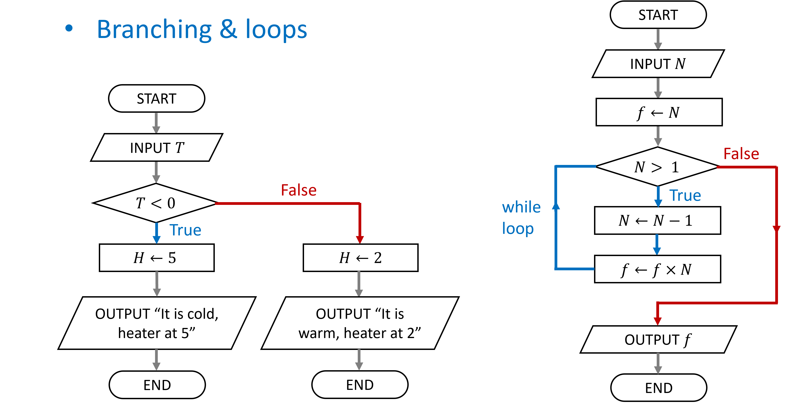

# Control flow: conditional branching and loops



In computational algorithms the next steps taken can depend on certain conditions: this is called branching of the flow. Often this branching is designed such that a "loop" occurs in the control flow: in this situation a specific code-block will be repeated until some stopping condition (or for a finite amount of times). In Python there are specific constructs for this purpose: 

-   Branching if/else statements
-   The while loop
-   Lists of objects
-   The for loop: iterating over a list

## Conditional branching: if/elif/else

Run **code-blocks** according to a **condition**

- An **`if`** code-block is executed when the condition is `True`
- [Optional] An **`else`** code-block is executed when the condition is `False`

::::: columns
::: column
``` python
if <condition>:
    <statement>
    ...
```
:::

::: column
``` python
if <condition>:
    <statement>
    ...
else:
    <statement>
    ...
```
:::
:::::

If one wants to test for multiple conditions and act accordingly, the **`elif`** keyword acts as a **`else if`**.
Multiple **`elif`** statements can follow an **`if`**, with an optional **`else`**:

::::: columns
::: column
``` python
if <condition>:
    <statement>
    ...
elif <condition>:
    <statement>
    ...
elif <condition>:
    <statement>
    ...
else:
    <statement>
    ...
```
:::

::: column
``` python
if <condition>:
    <statement>
    ...
elif <condition>:
    <statement>
    ...
elif <condition>:
    <statement>
    ...
```
:::
:::::

The statements that follow the **`if`** clause should be indented and form the **code-block** that will be executed according to a **condition**.
An **`if`** code-block is executed when the condition is `True`, for example:

```{python}
age = 46
if age >= 16:
  print("You can drive a tractor")  # if code-block
```

The **indented code-block** can also contain multiple statements, which will be all executed when the condition is `True`:

```{python}
speed_limit = 120
speed = 137
if speed > speed_limit:
  speed_diff = speed - speed_limit
  print(f"You drive {speed_diff} km/h too fast")
```

When the condition is `False` the **`if`** code-block will not be executed. In case an **`else`** code-block is added it will be executed when the condition is **`False`**:

```{python}
age = 11
if age > 18:
  print("You can drive a car")
else:
  print("You should take the bus")
```

In case you want to cover more then two cases, i.e. you have multiple conditions, the **`elif`** keyword can be used. You can use it multiple times, and optionally still use an **`else`** clause in the end:


```{python}
age = 17
if age > 18:
  print("You can drive a car")
elif age > 16:
  print("You can drive a tractor")
elif age > 15:
  print("You can drive a moped")
else:
  print("You can ride a bicycle")
```


In summary we can run **code-blocks** according to a **condition**

-   **`if`** code-block is executed when the condition is **`True`**
-   **`else`** code-block is executed when the condition is **`False`**
-   **`elif`** keyword acts as a **`else if`**
-   The **indented code-blocks** can contain multiple statements
-   The indentation should be the same within each code-block

Be careful with the indentation of the code-blocks otherwise your program will either exhibit unwanted behavior or will give an error, such as the following code:


```{python}
age = 19
if age > 18:
    print("You can drive a car")    # This line is indented differently
  print("You can drive a bicycle")
  print("You can drive a tractor")
```

## While Loop

A **`while` loop** repeats a code-block until the **condition** is **`False`**

``` python
    while <condition>:
      <statement>
      <statement>
      <statement>
      ...
      <statement>
```

A **`while` loop** is used when:

-   we don't know how many iterations we need, and
-   we have a stopping criterium/condition

As an example we update a certain number $x \rightarrow x^2 - 3x$ in each iteration and stop if the number becomes larger or equal to 1000:

```{python}
x = 1
while x < 1000:
  x = x ** 2 - 3 * x
  print(x)
print("End of the program")
```

Another a bit more complex example, we want to calculate the cumulative sums of the series $\sum_{n=1}^\infty \frac{1}{n^4}$ up to certain order $N$:

```{python}
x = 0; dx = 1; dx_min = 0.001; n = 1
while dx > dx_min:
  dx = 1 / n ** 4
  x = x + dx
  print(f"The series up to order N = {n} is: {x:6.5}")
  n = n + 1
print("End of the program")
```

Notice that the while loop can get in an infinite loop! This can happen if the stopping criterium is not adequate.

-   Stop the program with the stop button, in a terminal press key combination **`Ctrl`** + **`c`**
-   Adapt the stopping criterium/condition

Try the following code to get in an infinite loop:

``` python
n = 0
while n > -100:
  n = n + 1
  print(f"The current number is: {n}")
```

The most frequently used loop structure is actually not the `while` loop but the `for` loop. The `for` loop has the advantage that it can be run a specific number of times. But before we go to the `for` loop we will have a brief look at the `list` data type, since this is often used in conjunction with `for` loops when iterating over the elements of a `list`.

## Python lists

A Python list is a collection of objects with a certain order:

-   A list can contain several objects
-   The object types can be different
-   Lists are also objects themselves

```{python}
# A list with mixed object types
my_list_of_objects = ["It's Monday", False, 34, 23.4]

# Lists can be elements of a list
a_list_with_a_list = [5, 10.5, ["green", "red"], True]
print(a_list_with_a_list)
```

The **length of the list** is the number of elements. Applying the **`len()`** function: `len(a_list)`, allows us to find the number of elements.

```{python}
number_of_objects = len(my_list_of_objects)
print(number_of_objects)
```

There are many methods defined on lists, such as: Appending an element, removing an element, inserting an element, etc. 

When we **append** an element, the number of elements of the list increases with one:

```{python}
a_list = ["First", False, 34, 23.4]
print(a_list)
print(f"The length of the list = {len(a_list)}")
a_list.append("extra_element")
print(a_list)
print(f"The length of the adapted list = {len(a_list)}")
```

Notice that we use the dot-notation: `the_list.append(the_element)`:

-   This notation is to call a method on an object
-   We will see how to make our own methods (and classes) later in the chapter on object oriented programming
-   There are more methods we can make use of, see <https://docs.python.org/3/tutorial/datastructures.html#more-on-lists>

```{python}
a_list = ["First", False, 34, 5, 34]  # Define the list
a_list.remove(34)                     # Remove first 34
a_list.insert(3, "inserted_string")   # Insert str
print(a_list)                         # Print the list
```

### Selecting elements in a list

We can select an element of a list by its index, this is, its place in the list.

-   syntax for indexing: `a_list[element_index]`
-   index is zero-based
-   negative index starts from the end of the list

Using the above rules we can select a specific element from the list, when using index 0 we will get the first element:

```{python}
# Printing the first and then the second element
a_list = ["First", False, 34, 23.4]
print(a_list[0])
print(a_list[1])
```

Or selecting the last element using negative indexing:

```{python}
# Using negative indexing
a_list = ["First", False, 34, 23.4]
print(a_list[-1])
```

### Slicing a list

We can also select multiple elements, this is called **slicing**, the syntax for slicing is: `a_list[start:stop_exclusive]` where we employ the colon-operator to separate the start and stop indices.

```{python}
# A list with mixed object types
a_list = [23, 45, 65, 78, 92, 100, 102, 105 ]
print(a_list[2:5])
```

The `start` index can be omitted, then the selection is from the first element with index 0. For example, we can select the first five elements:

```{python}
# An empty start_index starts from the first index
a_list = [23, 45, 65, 78, 92, 100, 102, 105 ]
print(a_list[:5])
```

Likewise when the `stop` index is omitted, the selection is until (and including) the last element. For example, selecting all elements from the fourth element on can be done as:

```{python}
# An empty end_index end at the last index
a_list = [23, 45, 65, 78, 92, 100, 102, 105 ]
print(a_list[3:])
```

An additional **step** parameter can be used to skip elements: `a_list[start:stop_exclusive:step]`, again we use the colon-operator to separate the start/stop/step parameters. We can for example select every second element:

```{python}
# Take every second element by stepping
a_list = [23, 45, 65, 78, 92, 100, 102, 105 ]
print(a_list[1::2])
```

Or we can **reverse** the list by using a negative step:

```{python}
# Reverse the list by negative step
a_list = [23, 45, 65, 78, 92, 100, 102, 105 ]
print(a_list[::-1])
```


## The for loop

Similar to the while loop, the **`for`** loop can be used to repeat a process. Unlike the while loop the for loop is meant for when either:

-   the number of **iterations** is known, or
-   we iterate over a list of elements

The structure of the for loop to iterate over the elements of a list is as follows:

``` python
for <element> in <list>:
    <statement>
    <statement>
    ...
    <statement>
```

For example, to iterate over the working days of the week and print them, we could use

```{python}
# Print all elements of a list
days = ["Mon", "Tue", "Wed", "Thu", "Fri"]
for el in days:
  print(el)
```

### Repeating a process n times

The for loop can also be used to repeat a process a known number of times. For this we replace the list by the **`range`** function, which can represent a "list" of numbers. The **`range`** function returns actually an object of type `range` (which belongs to the more general class of `sequence` just like `list`) for integer numbers, we can construct it as follows: `range(start, stop_exclusive, step)`, where:

-   `start` is the first integer (default is zero), 
-   `stop_exclusive` is the last integer, 
-   `step` (default value is one), 
-   See also: <https://docs.python.org/3/library/stdtypes.html#range>

The `range()` does not give a list of integers, but a `range` object: this object is more memory efficient, it only generates the integer numbers when asked for (imagine you want to do billions of iterations). We can cast a range object into a list though:

```{python}
a_range = range(1, 10, 2)  # Construct a range
print(a_range)             # Lazy evaluated
print(list(a_range))       # Converted to a list
```

We can use a range object directly in a for loop instead of the list to iterate over:

```{python}
# Use the range function to get a sequence of numbers
for i in range(1,10,2):
  print(i)
```

Using range we can also get the indices of a list. We can use the indices to print only the odd days of the week for example:   

```{python}
# Use the range function to get indices
days = ["Mon", "Tue", "Wed", "Thu", "Fri", "Sat", "Sun"]
for i in range(0,len(days),2):
  print(days[i])
```

Or one could apply the same index to multiple lists:

```{python}
# Use the range function to get indices and apply to 2 lists
names = ["Mehmet", "Ceren", "Nisan", "Derin", "Ahmet", "Ali"]
lengths = ["189", "170", "182", "178", "177", "180"]
for i in range(len(names)):
  print(f"{names[i]} is {lengths[i]} cm.")
```

Notice that both lists need to have the same length and the elements should be corresponding to make sense.

## Example: The trajectory of a ball

In science and engineering we often use numerical methods to simulate systems. As a practical example of using a while loop, let us calculate the trajectory $(x(t), y(t))$ of a ball that is thrown numerically. The ball has an initial position $(x(0), y(0)) = (0, 1.20)$ (in meters) and velocity $v_0 = 6$ m/s thrown under an angle of 37 degrees, see the figure below. 


We consider following conditions:

-   Gravitation: $g=9.81$ m/s$^2$
-   Air resistance can be ignored for a "slow" heavy ball
-   The horizontal velocity is constant

The numerical algorithm calculates the balls position at small discrete time steps and updates the ball's velocity at each time step. The resulting coordinates form an approximate trajectory. The code uses the while loop to calculate subsequent coordinates until the ball drops on the ground (the stopping criterium). See the code below.

```{python}
#| code-line-numbers: "|1-3|4-8|10-14|16-19|21-32"
#| output-location: slide
# Load library for sine and cosine
import math

# Algorithm parameters in MKS units
v0 = 6
angle_in_degrees = 37
g = 9.81
x = 0; y = 1.20; t = 0

# Calculate initial velocity in x 
#     and y directions
angle = angle_in_degrees * math.pi/180
vx = v0 * math.cos(angle)
vy = v0 * math.sin(angle)

# Initiate values at time t = 0
x_values = list([x])
y_values = list([y])
t_values = list([t])

dt = 0.1
while (y >= 0) and (t < 10):
  # update velocities (vx, vy), coords
  #     (x, y), and time t
  vy = vy - g*dt
  y = y + vy*dt
  x = x + vx*dt
  t = t + dt
  x_values.append(x)
  y_values.append(y)
  t_values.append(t)
  print(f't = {t:.2f}: ({x:.2f},{y:.2f})')
```
