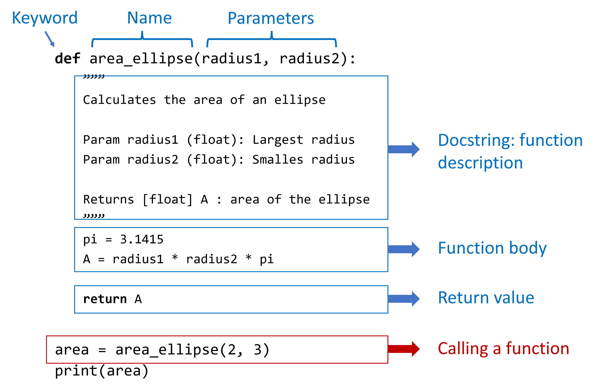

# Functions

**Functions** can be thought of little subprograms or subalgorithms within a larger program. They allow to 
reuse code, abstract away certain parts of code. A function: 

-   is a separate reusable pieces of code
-   can be invoked or called from the script
-   accepts 0 or more parameters
-   returns an object(s) (possible `None`)

## Function declaration



Functions are defined or "declared" in the program using the **`def`** keyword. After the **`def`** keyword comes the **name** of the function, then the parameters within round brackets, then we put a colon `:` which announces the start of the indented code block with the actual statements of the function. Before the code one optionally (but highly recommended) can add some documentation describing the function, and typically at the end of the code-block there is a return statement. 

Once the function is declared in the script-file it can be used by **calling** the function, this is done by using the name of the function followed by values for it's parameters between round brackets. We already many times called a function, e.g. when making print statements: `print("Hello world")` returning `None`, or sorting a list using `sorted([3, 1, 2])` returning `[1, 2, 3]`. The example function in the figure above as Python code:

```{python}
#| code-line-numbers: "|1-1|2-9|10-11|13-13|15-15|16-16"
def area_ellipse(radius1, radius2):
  """ 
  area_ellipse calculates the area of an ellipse

  Param radius1 (float): Largest radius
  Param radius2 (float): Smalles radius
  
  Returns [float] A : area of the ellipse
  """
  pi = 3.1415
  A = radius1 * radius2 * pi

  return A


area = area_ellipse(2, 3)
print(f"The area of the ellipse is {area}")
```

Notice that we leave two empty lines between the function definition and the script, in general we leave two empty lines between functions and/or the script. In the following code examples I will most often ignore this rule to keep the code examples shorter, but please adhere to the Python coding style in your own code. Likewise, I will keep the documentation of example scripts/functions to a minimum, but please document your own code.

## Return values

Functions return their output to the script by using the **`return`** keyword and then providing the value to be returned: 

- The returned value can be defined as an expression or variable (a variable is also an expression),
- Without any **`return`** keyword, the function returns **`None`**,
- Multiple outputs can be returned,
- We can put multiple **`return`** keywords, if the function

Straightforward example usage of the **`return`** keyword where we return the sum of to numbers as an expression, the expression is evaluated before the value is returned:

```{python}
def add(a, b):
  """ Sum a and b """
  return a + b

sum = add(2, 5)
print(sum)
```

We can also first put the value of the sum into a variable and then return the variable, again the same value is returned:

```{python}
def add(a, b):
  """ Sum a and b """
  sum = a + b
  return sum

sum = add(2, 5)
print(sum)
```

Without any **`return`** keyword, a function returns **`None`**, even if you performed some calculations within the function body (code-block):

```{python}
def add(a, b):
  """ Sum a and b """
  a + b

sum = add(2, 5)
print(sum)
```

### Multiple return values

One can define multiple outputs, we can do this by separating them with commas. The function actually returns a tuple as we can see when printing the output:

```{python}
def add(a, b):
  """ Sum a and b and give extra outputs """
  return a + b, "a second output", a - b

out = add(2, 5)
print(out)
```

When we have multiple output we can use unpacking of tuples to give assign the outputs immediately to separate variable names:

```{python}
import math

def polar_to_carth(radius, angle):
  """ polar_to_carth converts polar to carthesian """
  x = radius*math.cos(angle)
  y = radius*math.sin(angle)

  return x, y


x, y = polar_to_carth(3, math.pi/3)
print(f"Polar (3, pi/3) = {(x, y)}")
```

This unpacking (and packing) is actually a more general concept in Python and can be done with lists, tuples, strings, dictionaries, etc. For more information you can consult e.g. [this GeeksforGeeks article](https://www.geeksforgeeks.org/python/packing-and-unpacking-arguments-in-python/).

### Multiple return statements

**Multiple return statements** are also possible, each of them can even have a different number of outputs (although we like to avoid this, as it can give rise to confusion):

```{python}
def minimum(a, b):
  """ Returns the minimum of two numbers """
  if a <= b:
    return a
  else:
    return b

print(minimum(3.4, 6.5))
```

## Variable scope

The variables in the function code block are only locally, i.e. within the function accessible. Moreover, once the function returns/ends, the variable will not be accessible anymore (life time of the variable). More general we call the accessibility (global, local, ...) of the variable the **variable scope**.
Although the variables in the function are not accessible from outside of the function, we like to use often the same variable names as arguments. Notice that in the following example the **local** variable `a` is increased by one but the variable `a` of the script stays equal to 5:

```{python}
#| code-line-numbers: "|1-4|6-7|8-8|9-10|"
def increment(a):
  """ Increment number by 1 """
  a = a + 1
  return a

# Define the variable in the script
a = 5
print("Variable a (before) = " + str(a))
b = increment(a)
print("Variable a (after) = " + str(a))
print("Variable b = " + str(b))
```

In Python, functions can also use script variables from **outside** the function, but **cannot** change those variables:

```{python}
#| code-line-numbers: "|1-4|6-7|8-8|9-10|"
def increment(a):
  """ Increment number by 1 """
  a = a + x
  return a

# Define the variable in the script
a = 5
x = 4
print(increment(a))
```

In most cases, it is good to try to avoid using variables from **outside** the function, as it is more clear what the parameters of the function are when including all as arguments of the function. Therefore we will try to avoid using external variables in functions when giving examples.

In the following we try to change the external script variable by adding 3 to it, `x = x + 3`, which leads to an error:

```{python}
#| code-line-numbers: "|3-3|"
def increment(a):
  """ Increment number by 1 """
  a = a + x
  x = x + 3
  return a

# Define the variable in the script
a = 5
x = 4
print(increment(a))
```

## Functions calling functions

Functions can call other functions in their function body (code-block):

```{python}
def mean(a, b):
  """ Mean of a and b"""
  m = add(a, b) / 2
  return m

def add(a, b):
  """ Sum a and b"""
  return a + b  

a = 10; b = 2
print(mean(a, b))
```


### Functions as function parameter 

```{python}
def minimum(a, b):
  if a <= b:
    return a
  else:
    return b

def add(a, b, fct):
  """ Sum a, b and minimum of both """
  return a + b + fct(a, b) 

a = 10; b = 2
print(add(a, b, minimum))
```


### Recursive functions

A function can also call itself within its code-block. Such functions we call **recursive functions**. In the following example we have a function that will print numbers from $n$ to $1$, printing every number on a different line: 

```{python}
def count_down(n):
  print(n)
  if n > 0:
    count_down(n - 1)


count_down(10):
```

Recursive functions can be a little tricky to work with, notice how we can change the order of the numbers, transforming the function into **counting up** instead of **down**, by just putting the print statement behind the recursive call. This drastically changes what the function does:

```{python}
def count_up(n):
  if n > 0:
    count_up(n - 1)
  print(n)

a = 10; b = 2
count_up(10):
```

Remark that we use a condition to make the recursive function stop from calling itself at some point. It is clear that we need to be careful when defining recursive functions, we can easily get into some kind infinitely calling of the function, similar to getting into an infinite (while loop).

We can also have recursion with multiple functions, e.g. a function "A" calling function "B" which then calls in turn again function "A", in effect having again recursion.


## Side effects in functions

Functions can have side effects. When you provide mutable objects as arguments, e.g. lists or arrays, to a function, these objects can be adapted in-place. When these changes are undesired, we call them side effects. Let's consider the following function `median()` which calculates the median of a list of numbers. Because the function uses the in-place `sort()` method, the list is afterwards sorted and we lost the initial order:

```{python}
def median(numbers):
    numbers.sort()
    n = len(numbers)
    if (n % 2) == 1:
        m = numbers[int((n + 1) / 2)]
    else:
        m = (numbers[int(n/2-1)] + numbers[int(n/2)]) / 2
    return m

number_list = [3, 4, 5, 2, 8, 1, 6, 7]
med = median(number_list)
print(f"The median of {number_list} is {med}")
```

In principle we could avoid this by using the `sorted()` function instead:

```{python}
def median(numbers):
    numbers_sorted = sorted(numbers)
    n = len(numbers)
    if (n % 2) == 1:
        m = numbers_sorted[int((n + 1) / 2)]
    else:
        m = (numbers_sorted[int(n/2-1)] + numbers_sorted[int(n/2)]) / 2
    return m

number_list = [3, 4, 5, 2, 8, 1, 6, 7]
med = median(number_list)
print(f"The median of {number_list} is {med}")
```

Avoiding side effects helps us to have less errors when writing code.
However, the in-place method `sort()` uses less memory (no extra list) and is faster, especially for very large lists. So when using very large data objects, it is often better to use in-place methods, and carefully document what your function exactly does.
