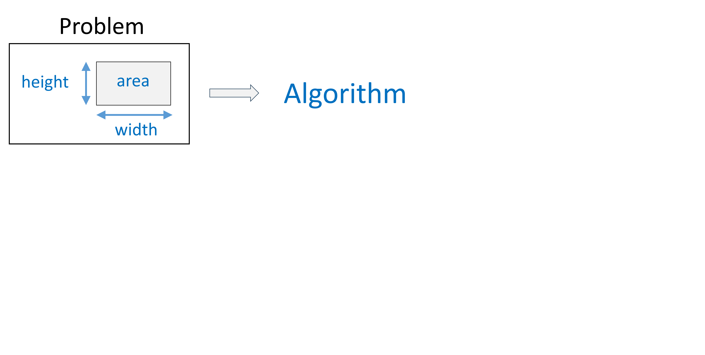
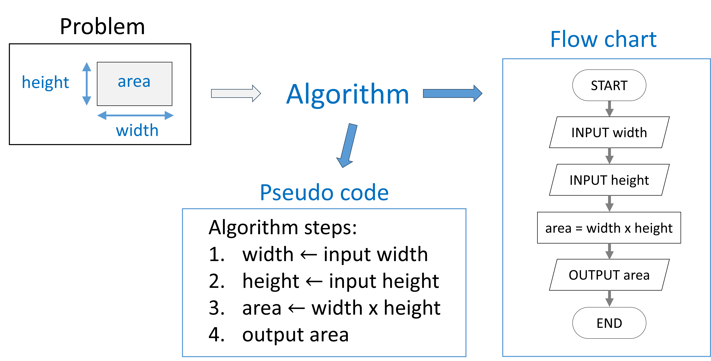
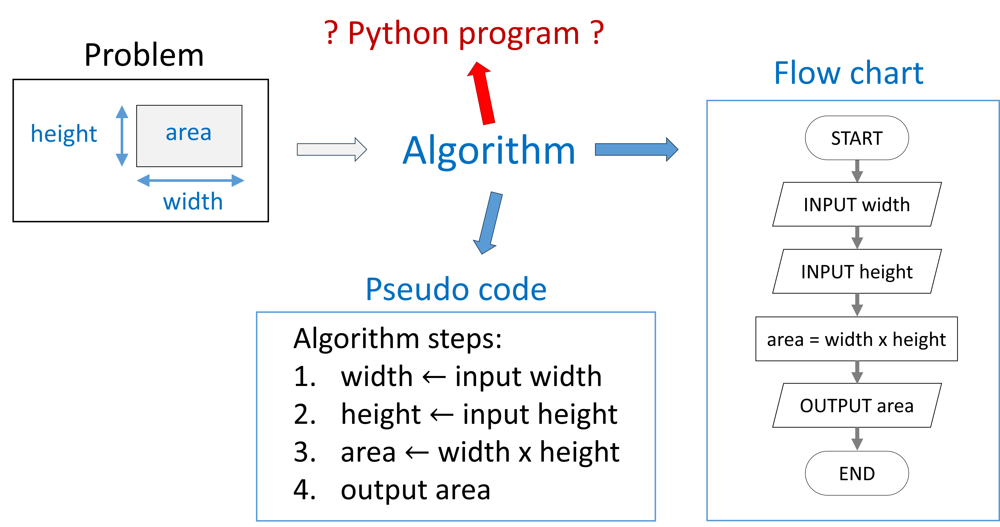

# Python basics & syntax

## Towards Python implementations



## Towards Python implementations



## [Towards Python implementations]{style="color:darkred; font-family: Calibri Light; font-size:48px; text-align: center; text-transform: uppercase;"}



## Python program structure

A Python script is a sequence of **statements** (algorithm steps), and **definitions** (functions, classes, …)

-   Definitions are evaluated
-   Statements are executed

Executing a program:

-   Execute statements **one by one** in the **Python Console**
-   Statements **stored** as a sequence in a **script file**

## The Python console

Execute statements one by one in the Python Console

``` {.python code-line-numbers="1|2|3|"}
>>> print(6)
6
>>> a = 10
>>>
```

Useful for:

-   quick calculations
-   testing the working of commands

## Python scripts

Statements stored in a script file

``` {.python}
a = 10
b = 25
prod = a * b
print(f"{a} times {b} = {prod}")
```

```{python }
#|echo: False
a = 10
b = 25
prod = a * b
print(f"{a} times {b} = {prod}")
```

Useful for:

-   running a program multiple times
-   incorrect lines can easily be found and corrected
-   larger programs

## Data objects

-   In Python everything is a data object: numbers, text, functions, class instances, etc.
-   Statements perform actions on data objects

Data objects can be scalar:

| Type       | Description         | (Example) values                     |
|------------|---------------------|--------------------------------------|
| `bool`     | Boolean value       | `True`, `False`                      |
| `int`      | Integer numbers     | .. , `-2`, `-1`, `0`, `-1`, `-2`, .. |
| `float`    | Floating point      | `3.56`, `23e-3`, `0.0079`            |
| `NoneType` | Indicates no object | `None`                               |

## Object type

-   Every object has a type

``` {.python}
print(type(6.22e23))
```

```{python}
#| echo: false
print(type(6.22e23))
```

-   Possible to convert between certain types: type casting

``` {.python}
it_is_raining = True
print(type(it_is_raining))
an_integer = int(it_is_raining)
print(type(an_integer))
```

```{python}
#| echo: false
it_is_raining = True
print(type(it_is_raining))
an_integer = int(it_is_raining)
print(type(an_integer))
```

## Object type

-   automatic type casting in some cases\
    [`float` \<= `int * float`]{style="color:darkblue"}\
    [`float` \<= `int + float`]{style="color:darkblue"}\
    [`float` \<= `int / int`]{style="color:darkblue"}\

``` {.python}
a = 4
b = 0.357
print( f"Type of (a * b) = {type(a * b)}" )
print( f"Type of (a / b) = {type(a / b)}" )
print( f"Type of (a + b) = {type(a + b)}" )
print( f"Type of (a / 25) = {type(a / 25)}" )
```

```{python}
#| echo: false
a = 4
b = 0.357
print( f"Type of (a * b) = {type(a * b)}" )
print( f"Type of (a / b) = {type(a / b)}" )
print( f"Type of (a + b) = {type(a + b)}" )
print( f"Type of (a / 25) = {type(a / 25)}" )
```

## Variables

A **variable** is a name bound to an **object**:

-   the object is **assigned** to the variable
-   In pseudo code indicated by $\leftarrow$

In python assignment operator is the "=" sign:

``` {.python}
a_variable_name = 4.5
```

The variable can be re-assigned another value or object:

``` {.python}
v = 4
v = v + 2                         # v becomes 6
v = "Now v is assigned text"      # v has type str
```

## Expressions & Operators

**Objects** can be combined by **operators** in **expressions**\
Most used arithmetic operators:

| symbol | description    | example      |
|--------|----------------|--------------|
| \*\*   | Power          | 3\*\*2 = 9   |
| /      | Division       | 5 / 4 = 1.25 |
| \*     | Multiplication | 3 \* 4 = 12  |
| \+     | Addition       | 5 + 7 = 12   |
| \-     | Subtraction    | 6 - 9 = -3   |
| \%     | modulo         | 34 % 6 = 4   |

## Expressions & Operators

Most used logic operators:

| symbol     | description             | example                                |
|--------------------|--------------------------|--------------------------|
| `<`, `>`   | smaller/larger than     | `5 > 4` $\rightarrow$ `True`           |
| `==`       | is equal to             | `3 == 6` $\rightarrow$ `False`         |
| `<=`, `>=` | smaller/larger or equal | `5 <= 5` $\rightarrow$ `True`          |
| `and`      | boolean AND             | `True and False` $\rightarrow$ `False` |
| `or`       | boolean OR              | `True or False` $\rightarrow$ `True`   |
| `not`      | boolean NOT             | `not True` $\rightarrow$ `False`       |

## Expressions

An expression can be built with following rules:\

-   `<expression>` $\overset{def}{=}$ `<object>` (an object is an expression)
-   `<expression>` $\overset{def}{=}$ `<operator> <expression>`
-   `<expression>` $\overset{def}{=}$ `<expression> <operator> <expression>`

Expressions result into values and can be assigned to variables:

``` {.python}
x = 4
y = 2*x**2 + 3*x - 5
print(f"The value of y = {y}")
```

```{python}
#| echo: false
x = 4
y = 2*x**2 + 3*x - 5
print(f"The value of y = {y}")
```

## Operator precedence and brackets

Precedence of operators is similar to mathematics.\
List of precedence of operators can be found on the python.org website: https://docs.python.org/3/reference/expressions.html#operator-precedence

Round brackets can be used to give priority

``` {.python}
x = 2
y = (12 - x) / 10 
print(f"The value of y = {y}")
```

```{python}
#| echo: false
x = 2
y = (12 - x) / 10 
print(f"The value of y = {y}")
```

## Text objects

Text objects are called strings: the type is `str` A string is defined by using single or double quotes:

``` {.python}
"This is a string, single 'quotes' can be used here"
'Here we can use double "quotes" inside it'
```

Strings can also cover multiple lines, for that we use triple quotes:

``` {.python}
""" This string runs over multiple lines.
Another line starts here.
And another one.
"""
```

Also triple single quotes work as well.

## Operators working on text objects

Appending one string to another with the "+" operator:

``` {.python}
a_verb = "flies"
print("The balloon" + a_verb)
print("The balloon" + " " + a_verb)
```

```{python}
#| echo: false
a_verb = "flies"
print("The balloon" + a_verb)
print("The balloon" + " " + a_verb)
```

Multiplying strings:

``` {.python}
print(5 * "balloon ")
```

```{python}
#| echo: false
print(5 * "balloon ")
```

Casting a string to a number and vice versa:

``` {.python}
print(5 * int("100"))
print(10 * str(50))
```

```{python}
#| echo: false
print(5 * int("100"))
print(10 * str(50))
```

## Formatting strings and numbers

A formatted string is a string with prefix `f` or `F`:

``` {.python}
the_radius = 25
formatted_str = f"A circle with radius {the_radius} m"
print(formatted_str)
```

```{python}
#| echo: false
the_radius = 25
formatted_str = f"A circle with radius {the_radius} m"
print(formatted_str)
```

More complex formatting:

``` {.python}
a = 1/6; b = 0.0145; c = 23e-6
print(f"The product {a} x {b} = {a * b}")
# Use format {variable:No_space.No_sign_digits}
print(f"{a:8.2} x {b:8.2} = {a * b:8.2}")
print(f"{a:8.2} x {c:8.2} = {a * c:8.2}")
```

```{python}
#| echo: false
a = 1/6; b = 0.0145; c = 23e-6
print(f"The product {a} x {b} = {a * b}")
print(f"{a:8.2} x {b:8.2} = {a * b:8.2}")
print(f"{a:8.2} x {c:8.2} = {a * c:8.2}")
```

## Python reserved words or keywords

-   A list of words **reserved** for Python
-   You cannot name variables (or functions/classes) similar

``` {.python}
# List of keywords can be found in the keyword package
import keyword

print(keyword.kw_list)
```

```{python}
#| echo: false
# List of keywords can be found in the keyword package
import keyword

print(keyword.kwlist)
```

## input & output (not in interactive mode)

-   `input()` can be used to ask user text input
-   `print()` can be used to output text

``` {.python style="font-size:32px;" code-line-numbers="1-3|5-10|12-13|"}
# parameters
pizza_price = 200
extra_cheese_price = 20

# input accepts a string parameter
n_pizza = input("How many pizza's do you want: ")
extra_cheese = input("""Do you want extra cheese?\n 
    For yes press [1]\n
    For no press [0]\n
Enter your choice""")

# Output to the user
print("Total cost: {int(n_pizza * (pizza_price + extra_cheese)}")
```

## Indentation

-   Is the amount of space preceding statements
-   Indentation should be the same within a code block
-   **Spaces** and **Tabs** are different
-   Following code will give an `IndentationError: unexpected indent`

``` {.python}
a = 4
b = 2
 c = 3
y = a * (b + c)
```

```{python}
#| echo: false
a = 4
b = 2
 c = 3
y = a * (b + c)
```

## Import statements

Python packages can be imported in multiple ways

``` {.python code-line-numbers="1-5|7-11|13-16"}
# import the package with its name
import math

area = 3**2 * math.pi
print(f"Area of a circle with radius 3 = {area}")

# import functions of the package separately
from math import sin, cos, pi, sqrt

angle = 23/180*pi
formula = sqrt(2/3) * sin(angle) + cos(angle)

# import packages or functions and rename them
from math import sqrt as sr

print(f"The square root of 2 = {sr(2)}")
```

# Tidy and Documented code

## Tidy Writing style

-   Writing **readable** code
-   Clear and not too long variable names
-   Use spaces in a consistent manner
-   Use a Python code formatter such as **Black**:\
    [https://github.com/psf/black]{link="https://github.com/psf/black"}
-   Document code both with **comments** and **docstrings**

## Comment lines

-   Text of a line after a hash symbol is ignored
-   The hash symbol can be in the beginning of the line:

``` {.python}
# A comment on a single line
```

Comments can explain the next line of code

``` {.python}
# Convert Matlab-indices to zero-based
ind = m_index - 1
```

Or the comment can start after a statement

``` {.python}
y = 12 + x  # An inline comment: #-symbol after 2 spaces
```

## Multi-line comments

Multi-line strings can be used as comments, but

-   they are not meant as comments (not ignored)
-   they can become docstrings (documentation-strings)

``` {.python}

''' 
This multi-line string is not assigned to a 
variable, therefore doesn't influence your code directly
'''

""" 
Docstrings consist of multi-line strings
but always use triple double quotes.
"""
```

## Docstrings

-   Docstrings are multi-line strings providing documentation\
-   They populate the `__doc__` variable
-   The help() function uses the `__doc__` variable

``` {.python}
import math
print(math.__doc__)
```

```{python}
#| echo: false
import math
print(math.__doc__)
```

## Docstrings

-   Docstrings are multi-line strings providing documentation\
-   They populate the `__doc__` variable
-   The help() function uses the `__doc__` variable

``` {.python}
import math
help(math.sin)
```

```{python}
#| echo: false
import math
help(math.sin)
```

-   We will revisit Docstrings for functions and classes later

# Program Errors

## Different error-types

Different types of errors can be encountered

-   **Syntax errors**: code inconsistent with the Python language, the code will not run (i.e. not start).\
-   **Runtime errors**: exceptions occurring while the program runs, the code will crash.\
-   **Semantic errors**: the code does not what was intended

## Syntax error examples

-   Usage of unknown identifiers (variable, function, class)

``` {.python}
positive_number = uint(45)
```

```{python}
#| echo: false
positive_number = uint(45)
```

-   Misaligned indentation

``` {.python}
a = 34
 b = 5
print(f"The sum is {a+b}")
```

```{python}
#| echo: false
a = 34
 b = 5
print(f"The sum is {a+b}")
```

-   Mistaken symbol ":" instead of ";"

``` {.python}
a = 3: b = 5
```

```{python}
#| echo: false
a = 3: b = 5
```

## Runtime error examples

-   Division by zero

``` {.python}
fraction = 1 / 0
```

```{python}
#| echo: false
fraction = 1 / 0
```

-   Type mismatch

``` {.python}
netto_price = 230.50
kdv_ratio = 0.21
print("Price: " + netto_price + " + " + kdv_ratio + " kdv")
```

```{python}
#| echo: false
netto_price = 230.50
kdv_ratio = 0.21
print("Price: " + netto_price + " + " + kdv_ratio + " kdv")
```

## Summary of Python basics

-   Structure of a program in Python
    -   Statements, expressions
-   Python syntax
    -   Known words
    -   Proper indentation
-   Commenting code
-   Error types: Syntax, Runtime, and logical errors


# Scientific algorithm: an example

## Trajectory of a ball


-   Gravitation: $g=9.81$ m/s$^2$
-   Air resistance: ignore for a slow heavy ball
-   horizontal velocity is constant

## How to compute the trajectory ?

The trajectory is a parabola (no air):

$$
\begin{aligned}
x &= x_0 + v_{x,0} t\\
y &= y_0 + v_{y,0} t - \frac{1}{2}g t^2
\end{aligned}
$$ The ball will hit the ground at time $t_e$:

$$
t_{e,\pm} = \frac{-b \pm \sqrt{b^2-4ac}}{2a} = \frac{v_{y,0} \mp \sqrt{v_{y,0}^2+2gy_0}}{g}
$$

## Time that the ball hits the ground

```{python}
#| code-line-numbers: "|1-2|4-8|10-13|"
# Loading packages for sin, cos, pi, sqrt
import math

# Parameters of the trajectory
y0 = 1.20; x0 = 0
v0 = 8
alpha0 = 37 * (math.pi / 180)  # Angle 
g = 9.81

# compute the time that the ball will hit the ground
vy0 = v0 * math.sin(alpha0) 
vx0 = v0 * math.cos(alpha0) 
te = (vy0 + math.sqrt(vy0**2 + 2*g*y0)) / g

print(f"The ball falls at time: {te} s")
```

## How to compute the trajectory ?

The trajectory is a parabola (no air):

$$
\begin{aligned}
x &= x_0 + v_{x,0} t\\
y &= y_0 + v_{y,0} t - \frac{1}{2}g t^2
\end{aligned}
$$

The equation for the parabola can be found by substitution. If $x_0 = 0$ then $t = x/v_{x,0} = x / (v_0 \cos(\alpha))$ and we obtain:

$$
y = y_0 + \tan(\alpha) \, x - \frac{1}{2}\frac{g\, x^2}{v_0^2\cos^2(\alpha)}
$$

## How far can we throw the ball ?

Let's start from the equation of the parabola:

$$
y = y_0 + \tan(\alpha) \, x - \frac{1}{2}\frac{g\, x^2}{v_0^2\cos^2(\alpha)}
$$

When solving this quadratic equation for $x$ we find:

$$
x_{e,\pm} = \frac{-b \pm \sqrt{b^2-4ac}}{2a} = \frac{\tan\alpha \mp \sqrt{\tan^2\alpha+2gy_0/(v_0\cos\alpha)^2}}{g / (v_0 \cos\alpha)^2}
$$ Where the largest root is the throwing distance.

## How far can we throw the ball ?

```{python}
#| code-line-numbers: "|1-2|4-8|10-15|"
# Loading packages for sin, cos, pi, sqrt
from math import sin, cos, pi, sqrt, tan

# Parameters of the trajectory
y0 = 1.20; x0 = 0
v0 = 8
alpha0 = 37 * (pi / 180)  # Angle in radians 
g = 9.81

# compute the time that the ball will hit the ground
vy0 = v0 * sin(alpha0) 
vx0 = v0 * cos(alpha0) 
xe_num = (tan(alpha0) + sqrt(tan(alpha0)**2 + 2*g*y0 / (v0*cos(alpha0))**2))
xe_den = (g / (v0 * cos(alpha0))**2)
xe = xe_num / xe_den

print(f"The ball falls at x: {xe} m")
```

## Trajectory of a ball

```{python}
#| output-location: slide
#| code-line-numbers: "|1-4|6-9|11-18|"
# Loading packages for plotting and numeric calc.
import matplotlib
import matplotlib.pyplot as plt
import numpy as np

# Computing x and y coordinates for the trajectory
ts = np.linspace(0, te, 10)
xs = vx0 * ts
ys = y0 + (vy0 * ts) - (g*ts**2)/2

# Plotting the trajectory of the ball
matplotlib.rcParams.update({'font.size': 20})
plt.plot(xs, ys, "-", color="red")
plt.plot(xs, ys, ".", color="blue")
ax = plt.gca()
ax.set_xlabel("x (in m)")
ax.set_ylabel("y (in m)")
ax.set_aspect('equal', 'box')
```


