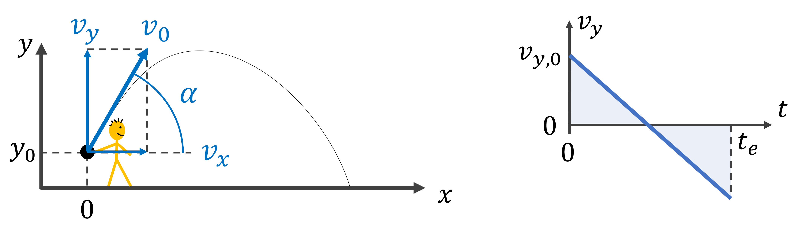

## Control flow: conditional branching and loops


## Control flow: conditional branching and loops

-   Branching if/else statements
-   The while loop
-   Lists of objects
-   The for loop: iterating over a list

# Conditional branching: if/elif/else

## Conditional branching

-   Run **code-blocks** according to a **condition**
    -   An **`if`** code-block is executed when the condition is `True`
    -   An **`else`** code-block is executed when the condition is `False`

::: columns
::: column
``` python
if <condition>:
    <statement>
    ...
```
:::

::: column
``` python
if <condition>:
    <statement>
    ...
else:
    <statement>
    ...
```
:::
:::

## Conditional branching

-   **`elif`** keyword acts as a **`else if`**
-   multiple **`elif`** statements can follow an **`if`**, with an optional **`else`**

::: columns
::: column
``` python
if <condition>:
    <statement>
    ...
elif <condition>:
    <statement>
    ...
elif <condition>:
    <statement>
    ...
else:
    <statement>
    ...
```
:::

::: column
``` python
if <condition>:
    <statement>
    ...
elif <condition>:
    <statement>
    ...
elif <condition>:
    <statement>
    ...
```
:::
:::

## Conditional branching

-   Run **code-blocks** according to a **condition**
    -   An **`if`** code-block is executed when the condition is `True`

```{python}
age = 46
if age >= 16:
  print("You can drive a tractor")  # if code-block
```

## Conditional branching

-   Run **code-blocks** according to a **condition**
    -   **`if`** code-block is executed when the condition is **`True`**
-   The **indented code-block** can contain multiple statements

```{python}
speed_limit = 120
speed = 137
if speed > speed_limit:
  speed_diff = speed - speed_limit
  print(f"You drive {speed_diff} km/h too fast")
```

## Conditional branching

-   Run **code-blocks** according to a **condition**
    -   **`if`** code-block is executed when the condition is **`True`**
    -   **`else`** code-block is executed when the condition is **`False`**

```{python}
age = 11
if age > 18:
  print("You can drive a car")
else:
  print("You should take the bus")
```

## Conditional branching

-   Run **code-blocks** according to a **condition**
    -   **`if`** code-block is executed when the condition is **`True`**
    -   **`else`** code-block is executed when the condition is **`False`**
    -   **`elif`** keyword acts as a **`else if`**

```{python}
age = 17
if age > 18:
  print("You can drive a car")
elif age > 16:
  print("You can drive a tractor")
else:
  print("You can ride a bicycle")
```

## Conditional branching

-   Run **code-blocks** according to a **condition**
    -   **`if`** code-block is executed when the condition is `True`
-   The **indented code-block** can contain multiple statements
-   indentation is the same within a code-block

```{python}
age = 19
if age > 18:
    print("You can drive a car")    # This line is indented differently
  print("You can drive a bicycle")
  print("You can drive a tractor")
```

# While Loop

## The while loop

-   Repeats code-block until the **condition** is **`False`**

-   A **`while` loop** is used when:

    -   we don't know how many iterations we need, and
    -   we have a stopping criterium/condition

    ``` python
    while <condition>:
      <statement>
      <statement>
      <statement>
      ...
      <statement>
    ```

## The while loop

-   Repeats code-block until the **condition** is **`False`**

-   A **`while` loop** is used when:

    -   we don't know how many iterations we need, and
    -   we have a stopping criterium/condition

    ```{python}
    t = 0; t_max = 10
    while t < t_max:
      t = t + 3.86
      print(f"The elapsed time is: {t:5.3} s")
    print("End of the program")
    ```

## The while loop

-   Repeats code-block until the **condition** is **`False`**

-   Can get in an infinite loop !

    -   Stop the program with the stop button, in a terminal press key combination **`Ctrl`** + **`c`**
    -   Adapt the stopping criterium/condition

    ``` python
    n = 0
    while n > -100:
      n = n + 1
      print(f"The current number is: {n}")
    ```

# Python lists

## Lists of objects

-   A list can contain several objects
-   The object types can be different
-   Lists are also objects

```{python}
# A list with mixed object types
my_list_of_objects = ["It's Monday", False, 34, 23.4]

# Lists can be elements of a list
a_list_with_a_list = [5, 10.5, ["green", "red"], True]
print(a_list_with_a_list)
```

## Lists of objects

-   Length of the list is the number of elements applying the **`len()`** function: `len(a_list)`
-   The object types can be different
-   Lists are also objects

```{python}
# A list with mixed object types
my_list_of_objects = ["It's Monday", False, 34, 23.4]

# Lists can be elements of a list
a_list_with_a_list = [5, 10.5, ["green", "red"], True]
print(a_list_with_a_list)
```

## Appending an element to a list

-   Append an element to the end of a list
-   Length (number of elements) of the list increases with one

```{python}
# Printing the first and then the second element
a_list = ["First", False, 34, 23.4]
print(a_list)
print(f"The length of the list = {len(a_list)}")
a_list.append("extra_element")
print(a_list)
print(f"The length of the adapted list = {len(a_list)}")
```

## More methods of list

-   We use the dot-notation: `the_list.append(the_element)`
-   This notation is to call a method on an object
-   We will see how to make our own methods (and classes) later in the chapter on object oriented programming
-   There are more methods we can make use of, see <https://docs.python.org/3/tutorial/datastructures.html#more-on-lists>

```{python}
a_list = ["First", False, 34, 5, 34]  # Define the list
a_list.remove(34)                     # Remove first 34
a_list.insert(3, "inserted_string")   # Insert str
print(a_list)                         # Print the list
```

## Selecting elements in a list

-   Select an element of a list by its index
-   syntax for indexing: `a_list[element_index]`
-   index is zero-based
-   negative index starts from the end of the list

```{python}
# Printing the first and then the second element
a_list = ["First", False, 34, 23.4]
print(a_list[0])
print(a_list[1])
```

## Selecting elements in a list

-   Select an element of a list by its index
-   syntax for indexing: `a_list[element_index]`
-   index is zero-based
-   negative index starts from the end of the list

```{python}
# Using negative indexing
a_list = ["First", False, 34, 23.4]
print(a_list[-1])
```

## Slicing a list

-   Selecting multiple elements is called **slicing**
-   syntax for slicing: `a_list[start:stop_exclusive]`

```{python}
# A list with mixed object types
a_list = [23, 45, 65, 78, 92, 100, 102, 105 ]
print(a_list[2:5])
```

## Slicing a list

-   Selecting multiple elements is called **slicing**
-   syntax for slicing: `a_list[start:stop_exclusive]`

```{python}
# An empty start_index starts from the first index
a_list = [23, 45, 65, 78, 92, 100, 102, 105 ]
print(a_list[:5])
```

```{python}
# An empty end_index end at the last index
a_list = [23, 45, 65, 78, 92, 100, 102, 105 ]
print(a_list[3:])
```

## Slicing a list

-   Selecting multiple elements is called **slicing**
-   syntax for slicing: `a_list[start:stop_exclusive]`
-   Additional step parameter: `a_list[start:stop_exclusive:step]`

```{python}
# Take every second element by stepping
a_list = [23, 45, 65, 78, 92, 100, 102, 105 ]
print(a_list[1::2])
```

# The for loop

## The for loop

-   To iterate: to repeat a process
-   A **`for`** loop can be used when:
    -   the number of **iterations** is known, or
    -   we iterate over a list of elements

``` python
for <element> in <list>:
    <statement>
    <statement>
    ...
    <statement>
```

## The for loop

-   To iterate: to repeat a process
-   A **`for`** loop can be used when:
    -   the number of **iterations** is known, or
    -   we iterate over a list of elements

```{python}
# Print all elements of a list
days = ["Mon", "Tue", "Wed", "Thu", "Fri"]
for el in days:
  print(el)
```

## Intermezzo: using range()

-   A **`range`** is a sequence type (like `list`) for integer numbers
-   Construct it using: `range(start, stop_exclusive, step)`
-   It is convenient for **`for`** loop
-   See also: <https://docs.python.org/3/library/stdtypes.html#range>

```{python}
# A list with mixed object types
a_range = range(1, 10, 2)  # Construct a range
print(a_range)             # Lazy evaluated
print(list(a_range))       # Converted to a list
```

## The for loop

-   To iterate: to repeat a process
-   A **`for`** loop can be used when:
    -   the number of **iterations** is known, or
    -   we iterate over a list of elements

```{python}
# Use the range function to get a sequence of numbers
for i in range(1,10,2):
  print(i)
```

## The for loop

-   To iterate: to repeat a process
-   A **`for`** loop can be used when:
    -   the number of **iterations** is known, or
    -   we iterate over a list of elements

```{python}
# Use the range function to get indices
days = ["Mon", "Tue", "Wed", "Thu", "Fri", "Sat", "Sun"]
for i in range(0,len(days),2):
  print(days[i])
```

# Example scientific algorithm

## Numerical approx. of the trajectory of a ball



-   Gravitation: $g=9.81$ m/s$^2$
-   Air resistance: ignore for a slow heavy ball
-   horizontal velocity is constant

## Trajectory of a ball

```{python}
#| code-line-numbers: "|1-3|4-8|10-14|16-19|21-32"
#| output-location: slide
# Load library for sine and cosine
import math

# Algorithm parameters in MKS units
v0 = 6
angle_in_degrees = 37
g = 9.81
x = 0; y = 1.20; t = 0

# Calculate initial velocity in x 
#     and y directions
angle = angle_in_degrees * math.pi/180
vx = v0 * math.cos(angle)
vy = v0 * math.sin(angle)

# Initiate values at time t = 0
x_values = list([x])
y_values = list([y])
t_values = list([t])

dt = 0.1
while (y >= 0) and (t < 10):
  # update velocities (vx, vy), coords
  #     (x, y), and time t
  vy = vy - g*dt
  y = y + vy*dt
  x = x + vx*dt
  t = t + dt
  x_values.append(x)
  y_values.append(y)
  t_values.append(t)
  print(f't = {t:.2f}: ({x:.2f},{y:.2f})')
```

## Numerical approximation errors

Comparison with exact trajectory obtained before

```{python}
#| echo: false
#| code-line-numbers: "|1-4|6-9|11-18|"
# Loading packages for plotting and numeric calc.
from math import sin, cos, tan, sqrt, pi
import matplotlib
import matplotlib.pyplot as plt
import numpy as np

# Computing x and y coordinates for the trajectory

# Algorithm parameters in MKS units
v0 = 6
angle_in_degrees = 37
g = 9.81
x = 0; y0 = 1.20; t = 0
alpha0 = angle_in_degrees * math.pi/180

# compute the time/location that the ball will hit the ground
vy0 = v0 * sin(alpha0) 
vx0 = v0 * cos(alpha0) 
te = (vy0 + math.sqrt(vy0**2 + 2*g*y0)) / g
xe_num = (tan(alpha0) + sqrt(tan(alpha0)**2 + 2*g*y0 / (v0*cos(alpha0))**2))
xe_den = (g / (v0 * cos(alpha0))**2)
xe = xe_num / xe_den


ts = np.arange(0, te, 0.1)
ts = np.hstack([ts, [te]])
xs_exact = vx0 * ts
ys_exact = y0 + (vy0 * ts) - (g*ts**2)/2

# Plotting the trajectory of the ball
matplotlib.rcParams.update({'font.size': 20})
plt.plot(xs_exact, ys_exact, "-", color="red")
plt.plot(x_values, y_values, "-", color="blue")
plt.plot(xs_exact, ys_exact, ".", color="red")
plt.plot(x_values, y_values, ".", color="blue")
ax = plt.gca()
ax.set_xlabel("x (in m)")
ax.set_ylabel("y (in m)")
ax.set_aspect('equal', 'box')
ax.legend(["Exact","Approx."]);
```

## Summary

- Control flow exists of
  - Branching if/else
  - `while`/`for` loops
- Allows implementing complex algorithms
- Lists are versatile data structures
- The `for` loop: iterating over list elements
- More complex **scientific algorithms**:
  - Iterative methods
  - Stopping criteria
