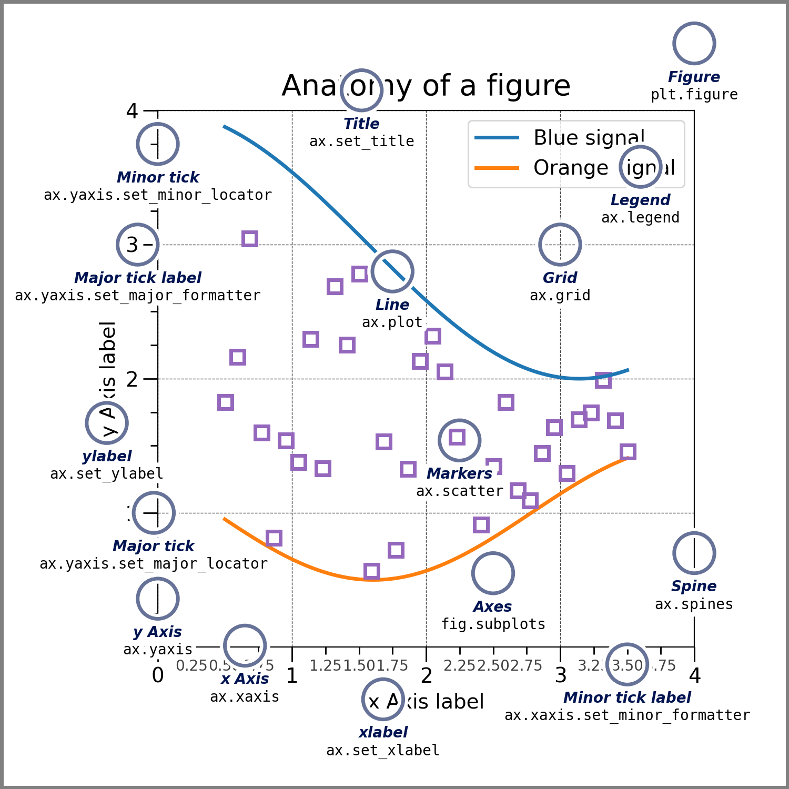

# Plotting with Matplotlib


## Basic plotting

```{python}
#| output-location: slide
# Import library for plotting and numerics
import numpy as np
import matplotlib.pyplot as plt

# Define x and y coordinates
x = np.linspace(-2, 2, 100)
y = x**2

# Plot a line between the coordinates
plt.plot(x, y)

```

## A Matplotlib figure

- Figure handle
- Figure size
- Subplots

::: fragment

```{python}
#| output-location: slide
import matplotlib.pyplot as plt

fig, ax = plt.subplots(figsize=(5,5))
plt.show()

```

:::


## A Matplotlib figure

Creating a curve in the axes

```{python}
#| output-location: slide
import matplotlib.pyplot as plt
import numpy as np

x = np.linspace(0, 1, 100)
y = np.sin(2*np.pi*x)
fig, ax = plt.subplots()
ax.plot(x, y)
plt.show()

```


## A Matplotlib figure

- Multiple plots 
- Multiple curves in a single axes

```{python}
#| output-location: slide
import matplotlib.pyplot as plt
import numpy as np

x = np.linspace(0, 1, 100)
y = np.sin(2*np.pi*x)

fig, ax = plt.subplots(1, 2) # Two columns
ax[0].plot(x, y)
ax[1].plot(x, y**2)
ax[1].plot(x, 1/(y+2))
plt.show()

```

## A Matplotlib figure

Subplots: multiple rows and columns

```{python}
#| output-location: slide
import matplotlib.pyplot as plt
import numpy as np

# Data for the plots
x = np.linspace(0, 1, 100)
y = np.sin(2*np.pi*x)

# Plotting
fig, ax = plt.subplots(2, 3)  # 2 rows, 3 cols
ax[0, 2].plot(x, y)
ax[1, 0].plot(x, 2-y)
plt.show()

```

## Parts of a plot

:::: {.columns}

::: {.column width=45%}
- Actual data: 
  - Curves, points, 
  - surfaces, etc.
- Axes, limits, aspect ratio
- Grids and thickmarks
- Title, Axis labels
- Legend
:::

::: {.column width=55%}


:::

::::

## Start from Matplotlib.org

There are many options !

- Different plot types.
- Many plot characteristics that can be changed.
- Animations.
- Good starting points: the Matplotlib website

[Starting with Matplotlib](https://matplotlib.org/stable/users/explain/quick_start.html)

[Matplotlib plot types](https://matplotlib.org/stable/plot_types/index.html)
